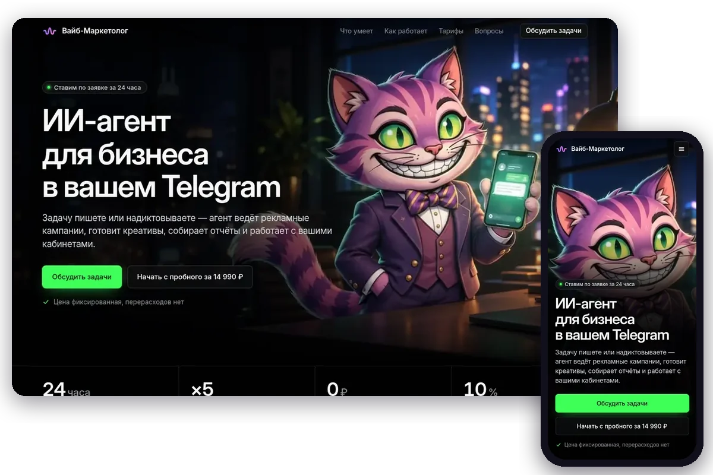
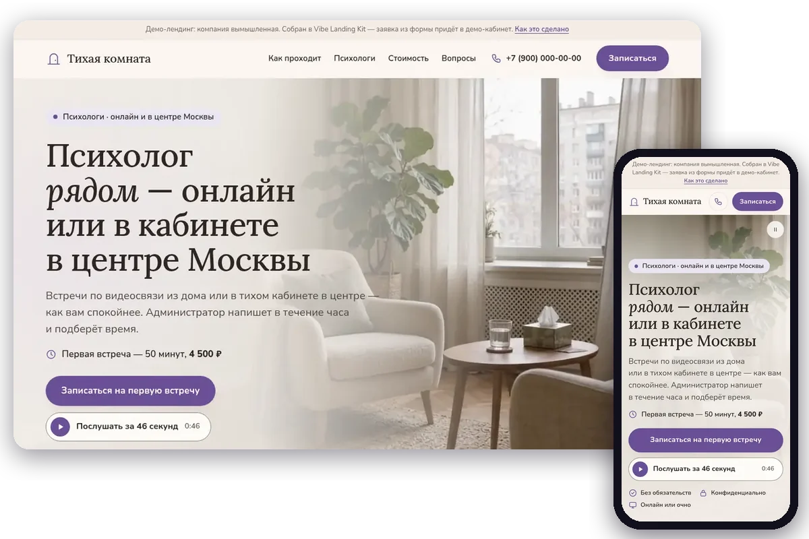
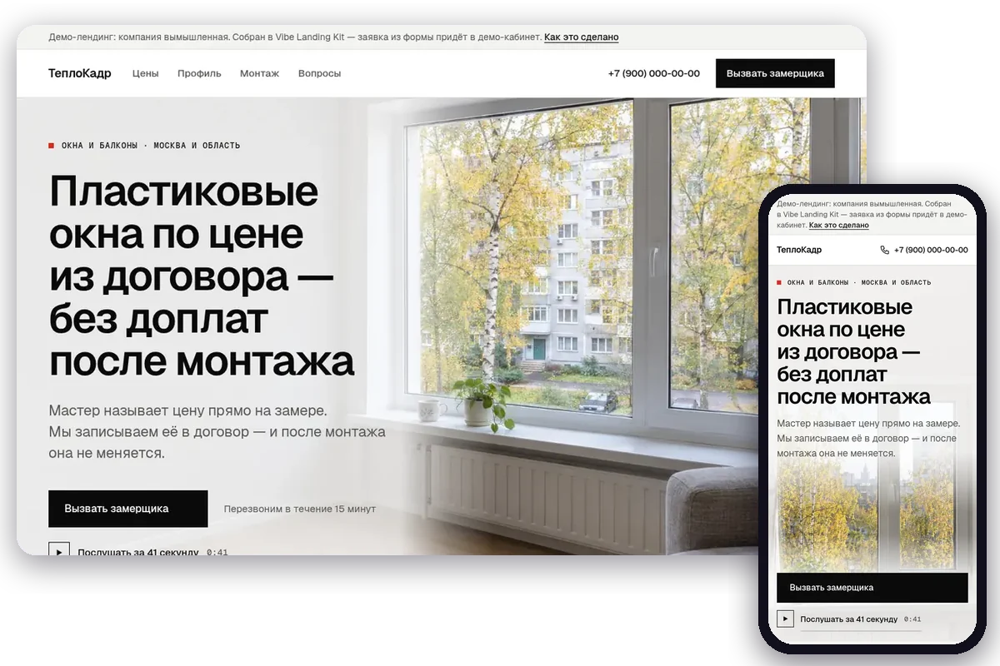
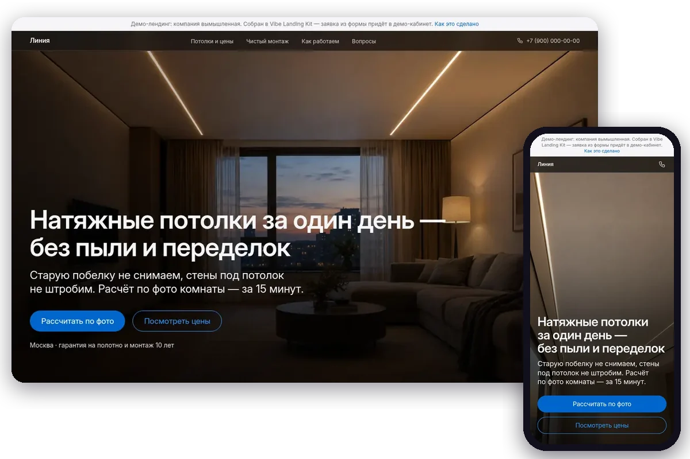
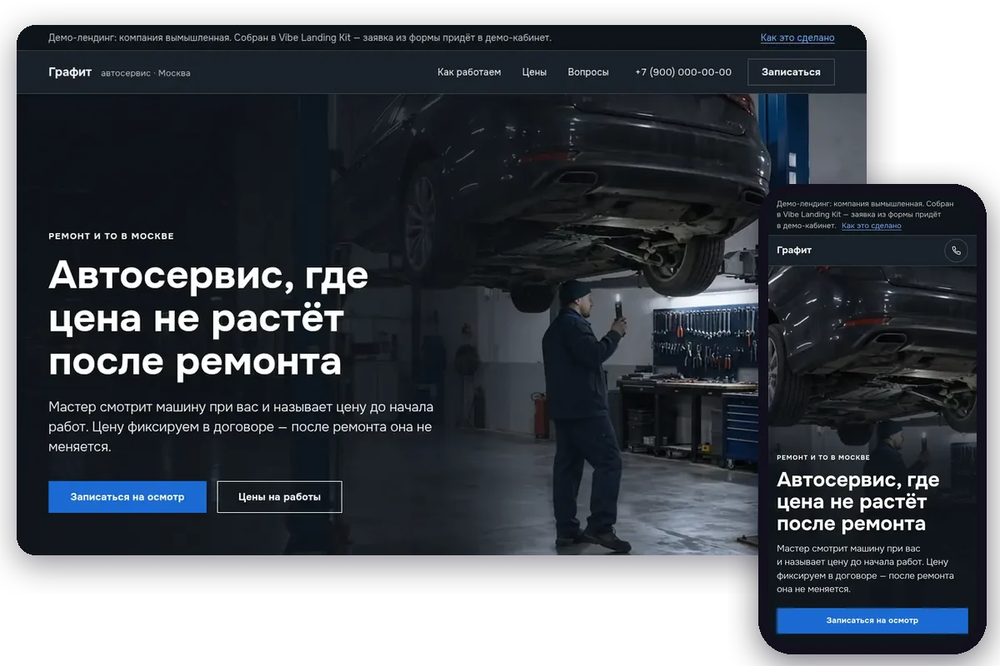
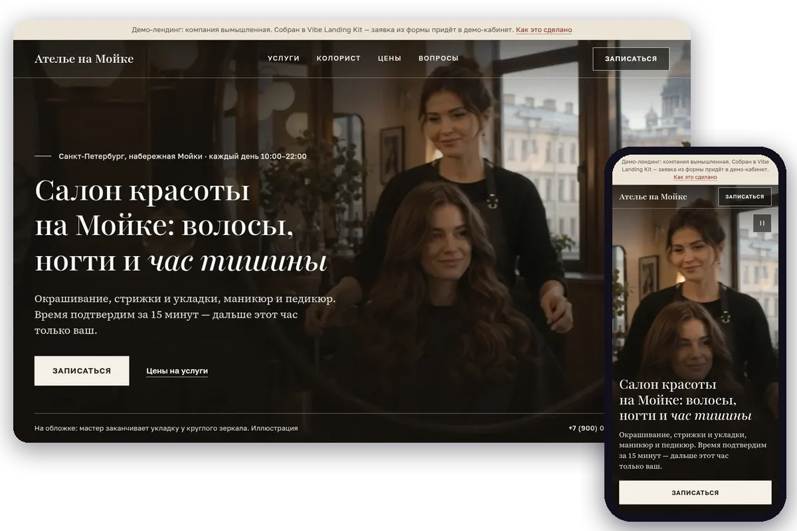
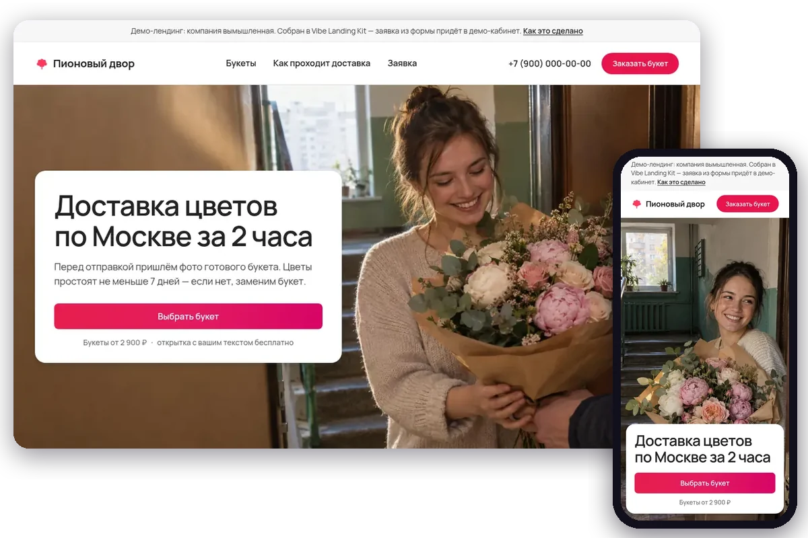

<div align="center">


# Vibe Landing Kit

**Hypothesis testing, done for you: one sentence to your AI agent — a landing page, an A/B test, leads in Telegram and ads in Yandex Direct.**
A full-bleed first screen with an image or video, a recurring character speaking Russian, leads delivered to Telegram,
an A/B test on one URL, a quality passport and an AI chatbot. 29 brand-inspired design systems, 26 motion recipes, 12 skills, Yandex Wordstat keywords.
For Claude Code, ChatGPT, Claude and Cursor.

[Русский](README.md) · **English**

</div>

---

## One command

```text
/plugin marketplace add vibemarketologru/vibe-landing-kit
/plugin install vibe-landing@vibe-landing-kit
/landing PVC windows in Moscow. Hypothesis: "price fixed in the contract" vs "from 9,900 ₽". Swiss style
```

The agent picks a style, researches keywords, makes the media, builds variant A and a variant B that differs in exactly one factor, passes the quality passport and launches the hypothesis — asking before every paid step.

## Live landing pages

The 6 most-searched niches on Yandex Wordstat plus our own product, each built with this workflow. The pages are live: open variant A and variant B (the companies in the demos are fictional, which is stated on the page).

<table>
<tr><td width="58%" valign="top"><a href="https://lk.vibemarketolog.ru/w/vibe-pro"></a></td><td valign="top"><b><a href="https://lk.vibemarketolog.ru/w/vibe-pro">Vibe Professional — an AI agent for business</a></b><br><sub>Our own product: 44,990 ₽/mo, trial tier 14,990 ₽/mo · "ии агент" — 71 972 searches/mo · style <a href="design-systems/linear/DESIGN.md">Linear</a></sub><br><br><b>Hypothesis.</b> Main button "Discuss tasks" vs "Start with the 14,990 ₽ trial".<br><b>Media.</b> Seamless mascot loop (Gemini Omni, forward-and-back), the mascot speaking Russian with captions, platform logo. Leads go to our sales team.<br><br><a href="https://lk.vibemarketolog.ru/w/vibe-pro?v=a">Variant A</a> · <a href="https://lk.vibemarketolog.ru/w/vibe-pro?v=b">Variant B</a></td></tr>
<tr><td width="58%" valign="top"><a href="https://lk.vibemarketolog.ru/w/psiholog-tihaya-komnata"></a></td><td valign="top"><b><a href="https://lk.vibemarketolog.ru/w/psiholog-tihaya-komnata">Quiet Room — psychologists</a></b><br><sub>Psychologist online and in-office · "психолог" — 3 042 109 searches/mo · style <a href="design-systems/soft/DESIGN.md">Мягкий</a></sub><br><br><b>Hypothesis.</b> Headline "A psychologist nearby" vs "A first session to see where to start".<br><b>Media.</b> Quiet office loop (Omni from a gpt-image-2.5 still), specialist portraits, an audio version of the page in a warm voice (Gemini TTS).<br><br><a href="https://lk.vibemarketolog.ru/w/psiholog-tihaya-komnata?v=a">Variant A</a> · <a href="https://lk.vibemarketolog.ru/w/psiholog-tihaya-komnata?v=b">Variant B</a></td></tr>
<tr><td width="58%" valign="top"><a href="https://lk.vibemarketolog.ru/w/okna-teplokadr"></a></td><td valign="top"><b><a href="https://lk.vibemarketolog.ru/w/okna-teplokadr">TeploKadr — PVC windows</a></b><br><sub>Windows and balconies, Moscow region · "пластиковые окна" — 1 623 402 searches/mo · style <a href="design-systems/swiss/DESIGN.md">Швейцарский</a></sub><br><br><b>Hypothesis.</b> Offer "price fixed in the contract" vs "from 9,900 ₽ turnkey, free measuring".<br><b>Media.</b> Hero still plus a vertical one for phones, a profile cross-section, an installer (gpt-image-2.5), an audio version in the master's voice, an AI chatbot trained on the page FAQ.<br><br><a href="https://lk.vibemarketolog.ru/w/okna-teplokadr?v=a">Variant A</a> · <a href="https://lk.vibemarketolog.ru/w/okna-teplokadr?v=b">Variant B</a></td></tr>
<tr><td width="58%" valign="top"><a href="https://lk.vibemarketolog.ru/w/potolki-liniya"></a></td><td valign="top"><b><a href="https://lk.vibemarketolog.ru/w/potolki-liniya">Liniya — stretch ceilings</a></b><br><sub>Stretch ceilings, Moscow · "натяжные потолки" — 1 317 124 searches/mo · style <a href="design-systems/apple/DESIGN.md">Apple</a></sub><br><br><b>Hypothesis.</b> Offer "in one day, no dust" vs "from 590 ₽ per m² installed".<br><b>Media.</b> Living room with light lines, a shadow gap and a kitchen (gpt-image-2.5), an Apple-style sticky frame with changing benefits.<br><br><a href="https://lk.vibemarketolog.ru/w/potolki-liniya?v=a">Variant A</a> · <a href="https://lk.vibemarketolog.ru/w/potolki-liniya?v=b">Variant B</a></td></tr>
<tr><td width="58%" valign="top"><a href="https://lk.vibemarketolog.ru/w/avtoservis-grafit"></a></td><td valign="top"><b><a href="https://lk.vibemarketolog.ru/w/avtoservis-grafit">Grafit — car service</a></b><br><sub>Repairs and maintenance, Moscow · "автосервис" — 1 151 351 searches/mo · style <a href="design-systems/bmw/DESIGN.md">BMW</a></sub><br><br><b>Hypothesis.</b> Offer "the price does not grow after the repair" vs "same-day repair with video from the lift".<br><b>Media.</b> A night workshop animated by Omni that stops on its last frame; master Andrey is one character across the portrait and a Russian-speaking video (voice bound to the character).<br><br><a href="https://lk.vibemarketolog.ru/w/avtoservis-grafit?v=a">Variant A</a> · <a href="https://lk.vibemarketolog.ru/w/avtoservis-grafit?v=b">Variant B</a></td></tr>
<tr><td width="58%" valign="top"><a href="https://lk.vibemarketolog.ru/w/salon-na-moike"></a></td><td valign="top"><b><a href="https://lk.vibemarketolog.ru/w/salon-na-moike">Atelier on the Moika — beauty salon</a></b><br><sub>Hair and nails, Saint Petersburg · "салон красоты" — 1 139 180 searches/mo · style <a href="design-systems/editorial/DESIGN.md">Журнал</a></sub><br><br><b>Hypothesis.</b> Offer "hair, nails and an hour of quiet" vs "a colorist picks the shade before coloring".<br><b>Media.</b> A magazine cover — an Omni video from a still with a round mirror, a photo essay (gpt-image-2.5).<br><br><a href="https://lk.vibemarketolog.ru/w/salon-na-moike?v=a">Variant A</a> · <a href="https://lk.vibemarketolog.ru/w/salon-na-moike?v=b">Variant B</a></td></tr>
<tr><td width="58%" valign="top"><a href="https://lk.vibemarketolog.ru/w/cvety-pionovyi-dvor"></a></td><td valign="top"><b><a href="https://lk.vibemarketolog.ru/w/cvety-pionovyi-dvor">Peony Yard — flower delivery</a></b><br><sub>Flower delivery in Moscow · "доставка цветов" — 891 858 searches/mo · style <a href="design-systems/airbnb/DESIGN.md">Airbnb</a></sub><br><br><b>Hypothesis.</b> Main button "Choose a bouquet" vs "Get a photo of the bouquet before delivery".<br><b>Media.</b> A documentary delivery shot plus a vertical one, four bouquets for catalog cards (gpt-image-2.5).<br><br><a href="https://lk.vibemarketolog.ru/w/cvety-pionovyi-dvor?v=a">Variant A</a> · <a href="https://lk.vibemarketolog.ru/w/cvety-pionovyi-dvor?v=b">Variant B</a></td></tr>
</table>

## Media on the first screen

The `landing-media` skill: a composed still by **gpt-image-2.5** (plus a vertical one for phones) → animated by **Gemini Omni** (poster = first frame, no flash) → one character or mascot speaking one Russian voice across all videos → an optional audio version of the page in the same voice. Each design system's `media` block repeats how the brand places media. Every still is reviewed by eye and every spoken line is checked by speech recognition before publishing.

## Hypothesis launch

`landing_check` (free passport in a real browser) → `landing_launch` (990 ₽: URL, lead delivery to cabinet/Telegram/email, 50/50 A/B test with a significance verdict, a test lead) → `landing_update` (free) → `landing_status` (free: a test plan fixed at launch, the server declares a winner only once the plan is met, confidence interval, sample-ratio check, version history; sales per variant from Bitrix24 with `crm=bitrix`) → `landing_pro` (4,500 ₽, full site from the winning variant).

## Skills library

| Skill | What it gives |
|---|---|
| [`landing-ab`](skills/landing-ab/SKILL.md) | Main route: from hypothesis to a running test |
| [`hypothesis-lab`](skills/hypothesis-lab/SKILL.md) | Hypothesis template, ICE/PIE, sample size and budget, A/A test, verdict without peeking |
| [`landing-brief`](skills/landing-brief/SKILL.md) | A–G brief, a design seed against template look, 21 section layouts, a 14-point review |
| [`design-system`](skills/design-system/SKILL.md) | Catalog style: tokens for both themes, Cyrillic fonts, components |
| [`brand-to-system`](skills/brand-to-system/SKILL.md) | The client's brand book turned into a catalog entry with contrast checks |
| [`semantics`](skills/semantics/SKILL.md) | Headlines, FAQ and negative keywords from Yandex Wordstat |
| [`landing-media`](skills/landing-media/SKILL.md) | First-screen still, one character across videos, Russian speech, audio version |
| [`motion`](skills/motion/SKILL.md) | Motion recipes with reduced-motion |
| [`landing-mobile`](skills/landing-mobile/SKILL.md) | Phones: a 30-point checklist, iOS 26/27, Android, VK and Telegram in-app browsers |
| [`landing-law-ru`](skills/landing-law-ru/SKILL.md) | 152-FZ, advertising law, ad moderation — consent and policy templates |
| [`landing-chatbot`](skills/landing-chatbot/SKILL.md) | AI chatbot on the page: trained on the FAQ and site, widget in the style colors |
| [`ad-match`](skills/ad-match/SKILL.md) | Ads for the variants: the ad promises what the first screen shows; A and B campaigns pushed straight into Yandex Direct; auto-stop rules |

## Phones: iOS 26/27 and Android

70–85% of ad traffic lands on a phone. `landing-mobile` covers what actually changes: iOS 26 no longer tints the browser bars from `theme-color` (it samples the page and edge-pinned layers, so set a background on `html` and `body`), `100svh` first screens, 16px+ inputs, sticky CTA hidden near the form and while the keyboard is open, `muted playsinline` video with a meaningful poster (Low Power Mode never autoplays), Safari 27 `sizes="auto"` and scroll anchoring. Run the passport locally: `node tools/passport.mjs index.html b.html`.

## AI chatbot on the landing page

`chatbot_create_site` (free) → `chatbot_learn` / `chatbot_learn_site` (5 ₽ per FAQ item, 10 ₽ per page, 4 ₽ per crawled page up to 30) → `chatbot_widget` (free; one `<script>` line, placed identically in A and B) → answers from 2 ₽, no subscription → `chatbot_conversations` for dialogs and operator replies.

## Yandex Direct ads

Once the page is live, the agent takes the campaign through the user's Yandex Direct account step by step. A clean page test sends neutral ads to the shared URL; ad-to-page bundles use `?ad=a` / `?ad=b` and are measured separately (`?v=` is preview only). `direct_import_campaign` (free) saves a draft and checks Direct limits; `direct_publish_campaign` (99 ₽) sends it **as a draft**; `direct_moderate` (free) submits ads for moderation with a safety lock — the start date moves 30 days ahead, so approval does not start ads; `direct_launch_preflight` (free) reads the campaign back from Direct and issues a launch plan; after the user says yes, `direct_launch` (9 ₽) sets the agreed start date. Edits to a live campaign cost 9 ₽, pausing is free, `connection_health` checks every connection for free.

## What is inside

- **Design systems** (`design-systems/*.json`, `theme.css`, `DESIGN.md`): role-based color tokens for light and dark themes with contrast checked in both, mobile and desktop type scale, OFL fonts with Cyrillic instead of proprietary brand fonts, landing-page section order, a lead form with consent, A/B axes, brand media rules, do/don't and a ready prompt snippet.
- **Motion recipes** (`motion/*.json`): HTML + CSS + vanilla JS, `transform`/`opacity` only, `prefers-reduced-motion` mode (kept, removed, softened to a fade), pause for infinite animations.
- **Claude Code plugin**: `/landing` command, 12 skills and the MCP server. ChatGPT and Claude.ai get the route and brief through the `landing_guide` tool (their chats do not show MCP prompts to the model).

## Connect

- Claude Code: `claude mcp add --transport http vibemarketolog https://lk.vibemarketolog.ru/mcp`, then `/mcp` → Authenticate.
- ChatGPT / Claude.ai / Cursor: [step-by-step videos](https://lk.vibemarketolog.ru/connect?utm_source=github&utm_medium=readme&utm_campaign=vibe-landing-kit); what to type in ChatGPT step by step (in Russian) — [docs/chatgpt-step-by-step.md](docs/chatgpt-step-by-step.md).
- REST: `/api/agent/design-systems`, `/motion`, `/semantics`, `/landings`, `/landings/check`, `/chatbots`, `/uploads/image`, `/uploads/links`, `/media/check`, `/media/loop` — [docs](https://lk.vibemarketolog.ru/docs/agent-api?utm_source=github&utm_medium=readme&utm_campaign=vibe-landing-kit).

The catalog, the passport, edits and test results are free. Keywords, media and the launch are paid from a ruble balance, per action, no subscription.

## Partner program

Invite your clients with your link and earn 10% of their top-ups, rising to 30% with the referred turnover — [lk.vibemarketolog.ru/partner](https://lk.vibemarketolog.ru/partner?utm_source=github&utm_medium=readme&utm_campaign=vibe-landing-kit).

## License and trademarks

MIT. Brand-inspired entries describe an aesthetic and are not affiliated with the brands; no logos or proprietary fonts — see [TRADEMARKS.md](TRADEMARKS.md) and [NOTICE.md](NOTICE.md). Demo companies are fictional; media was generated for the examples.

**Author:** Vladimir Doretskiy, founder of [Vibe Marketolog](https://vibemarketolog.ru?utm_source=github&utm_medium=readme&utm_campaign=vibe-landing-kit) · Telegram [@CentrMedia](https://telegram.me/CentrMedia)
