<div align="center">

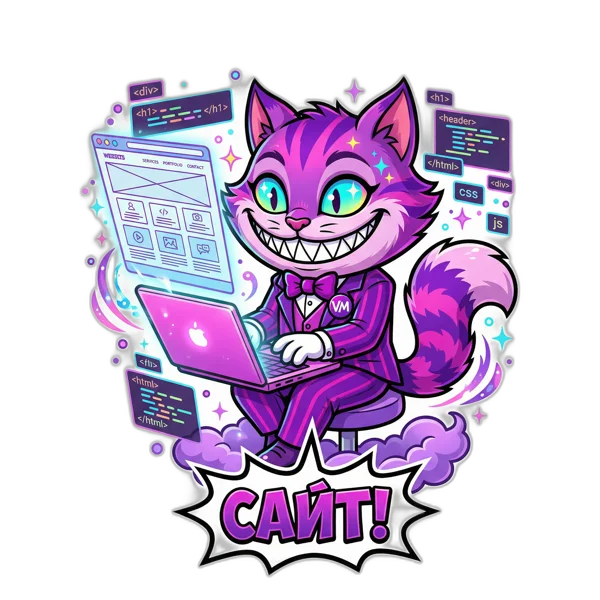

# Vibe Landing Kit

**Лендинг для A/B-теста рекламы — от брифа до работающей гипотезы одной командой агенту.**
Атмосферный первый экран с картинкой или видео на всю ширину, персонаж с русской речью, заявки в Telegram,
A/B-тест на одном адресе, паспорт качества и чат-бот с ИИ. 29 дизайн-систем в духе мировых брендов, 26 анимаций, 12 навыков, семантика Вордстата.
Для Claude Code, ChatGPT, Claude и Cursor.

[](CHANGELOG.md)
[](LICENSE)
[](#живые-лендинги)
[](#дизайн-системы)
[](#библиотека-навыков)
[](#подключение)
[](https://lk.vibemarketolog.ru/connect)

**Русский** · [English](README.en.md)

</div>

---

## Одна команда

```text
/plugin marketplace add vibemarketologru/vibe-landing-kit
/plugin install vibe-landing@vibe-landing-kit
/landing Пластиковые окна в Москве. Гипотеза: «цена из договора» против «от 9 900 ₽». Стиль швейцарский
```

Агент пройдёт весь путь сам и остановится перед каждым платным шагом, назвав цену:

```mermaid
flowchart LR
  Z[Гипотеза<br/>и выборка] --> A[Бриф]
  A --> B[Стиль из каталога]
  B --> C[Семантика Вордстата]
  C --> D[Медиа: кадр, персонаж, видео]
  D --> E[Вариант А:<br/>телефон, закон, чат-бот]
  E --> F[Вариант Б:<br/>одно отличие]
  F --> G[Паспорт качества]
  G --> H[Запуск: адрес, заявки,<br/>A/B-тест]
  H --> R[Реклама<br/>под варианты]
  R --> I[Итоги теста]
```

> [!TIP]
> Каталог работает и без подключения: каждая система лежит в репозитории как JSON, готовый `theme.css` для обеих тем и `DESIGN.md`. Передайте файл любому агенту — он сверстает страницу в этом стиле.

## Живые лендинги

6 самых частотных ниш по Яндекс Вордстату и наш собственный продукт. Каждый собран этим маршрутом: стиль из каталога, медиа на весь первый экран, два варианта с одним отличием, паспорт, запуск. Страницы работают: откройте вариант A и вариант Б, отправьте заявку — она придёт в кабинет (компании в примерах вымышленные, это отмечено на странице).

<table>
<tr><td width="58%" valign="top"><a href="https://lk.vibemarketolog.ru/w/vibe-pro">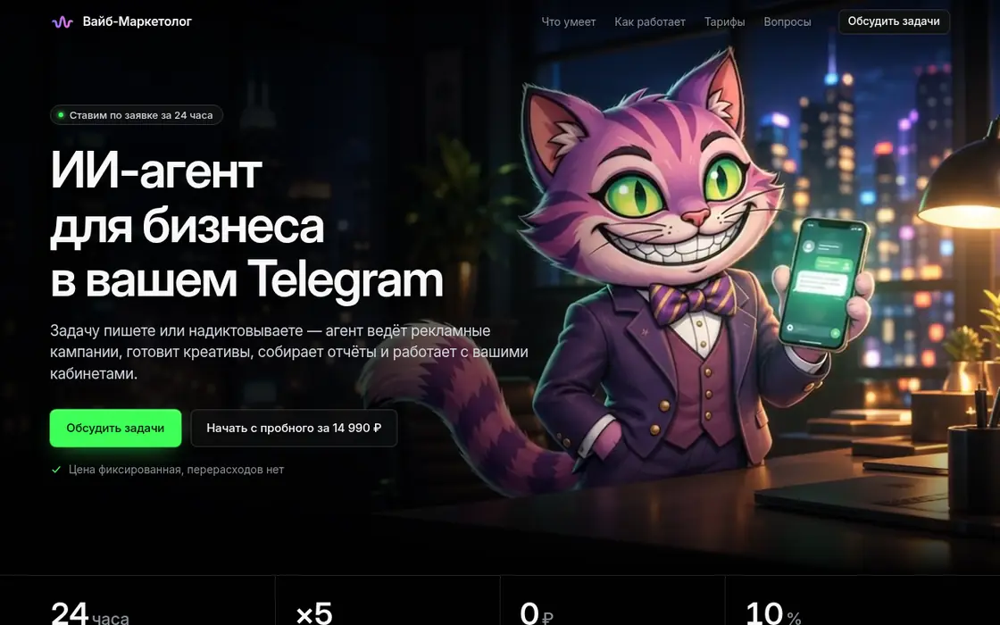</a><a href="https://lk.vibemarketolog.ru/w/vibe-pro">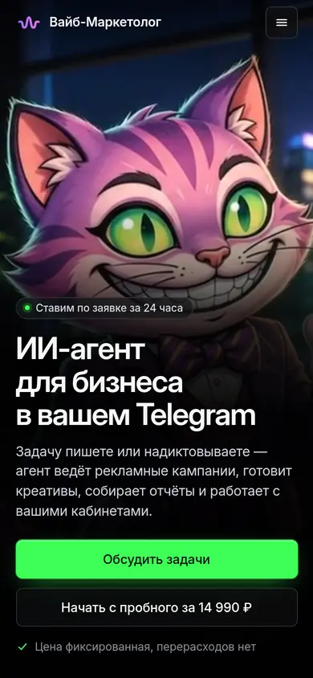</a></td><td valign="top"><b><a href="https://lk.vibemarketolog.ru/w/vibe-pro">Вайб Профессиональный — ИИ-агент для бизнеса</a></b><br><sub>Наш продукт: 44 990 ₽/мес, пробная ступень 14 990 ₽/мес · «ии агент» — 71 972 показов/мес · стиль <a href="design-systems/linear/DESIGN.md">Linear</a></sub><br><br><b>Гипотеза.</b> Главная кнопка «Обсудить задачи» против «Начать с пробного за 14 990 ₽».<br><b>Медиа.</b> Фоновая петля с маскотом (Gemini Omni, «вперёд и назад» без шва), ролик-обращение маскота с русской речью и субтитрами, логотип платформы. Заявки уходят в отдел продаж.<br><br><a href="https://lk.vibemarketolog.ru/w/vibe-pro?v=a">Вариант A</a> · <a href="https://lk.vibemarketolog.ru/w/vibe-pro?v=b">Вариант Б</a></td></tr>
<tr><td width="58%" valign="top"><a href="https://lk.vibemarketolog.ru/w/psiholog-tihaya-komnata">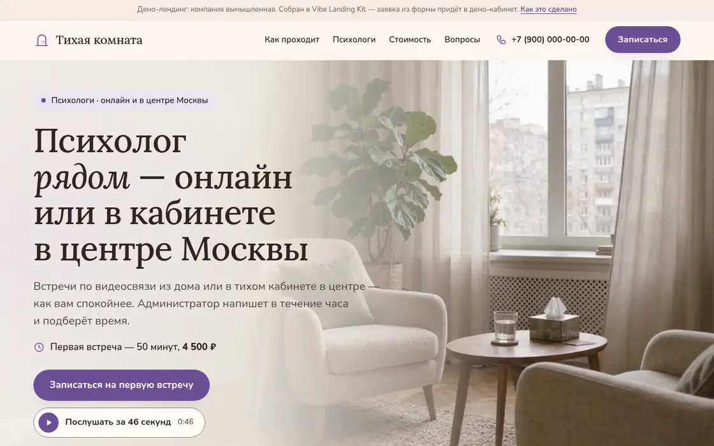</a><a href="https://lk.vibemarketolog.ru/w/psiholog-tihaya-komnata">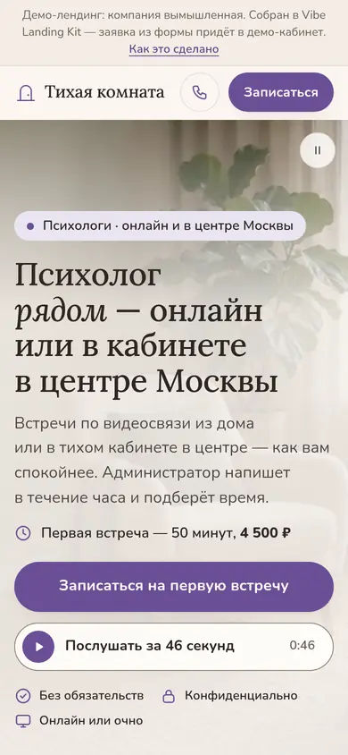</a></td><td valign="top"><b><a href="https://lk.vibemarketolog.ru/w/psiholog-tihaya-komnata">Тихая комната — психологи</a></b><br><sub>Психолог онлайн и в кабинете · «психолог» — 3 042 109 показов/мес · стиль <a href="design-systems/soft/DESIGN.md">Мягкий</a></sub><br><br><b>Гипотеза.</b> Заголовок «Психолог рядом» против «Первая встреча — чтобы понять, с чего начать».<br><b>Медиа.</b> Тихая петля кабинета (Omni из кадра gpt-image-2.5), портреты специалистов, аудиоверсия страницы тёплым голосом (Gemini TTS).<br><br><a href="https://lk.vibemarketolog.ru/w/psiholog-tihaya-komnata?v=a">Вариант A</a> · <a href="https://lk.vibemarketolog.ru/w/psiholog-tihaya-komnata?v=b">Вариант Б</a></td></tr>
<tr><td width="58%" valign="top"><a href="https://lk.vibemarketolog.ru/w/okna-teplokadr">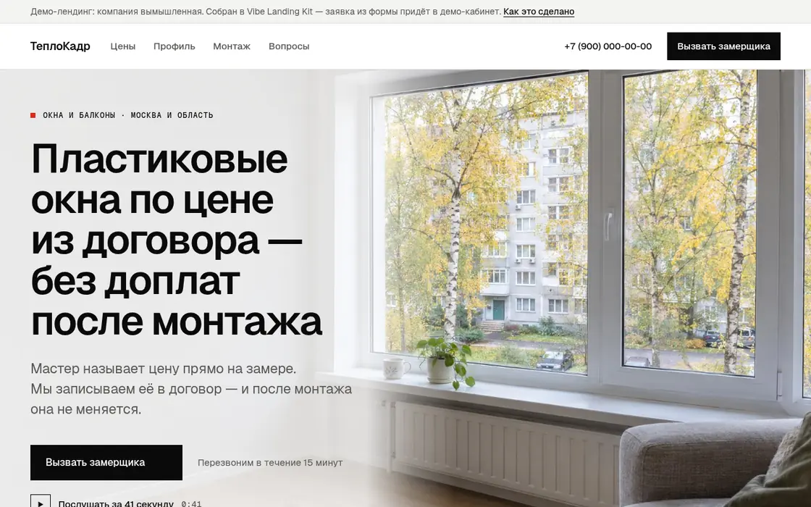</a><a href="https://lk.vibemarketolog.ru/w/okna-teplokadr">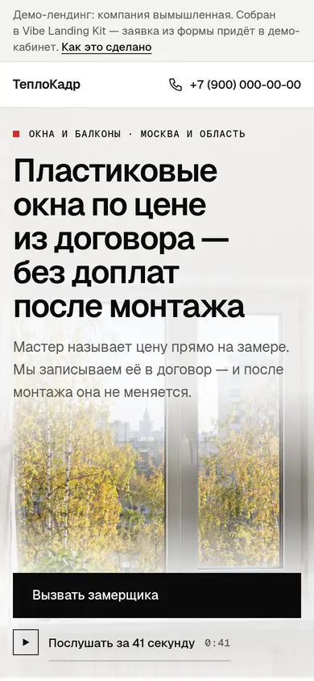</a></td><td valign="top"><b><a href="https://lk.vibemarketolog.ru/w/okna-teplokadr">ТеплоКадр — пластиковые окна</a></b><br><sub>Окна и балконы, Москва и область · «пластиковые окна» — 1 623 402 показов/мес · стиль <a href="design-systems/swiss/DESIGN.md">Швейцарский</a></sub><br><br><b>Гипотеза.</b> Оффер «цена из договора, без доплат» против «от 9 900 ₽ под ключ, замер бесплатно».<br><b>Медиа.</b> Кадр первого экрана и вертикальный для телефона, разрез профиля, монтажник (gpt-image-2.5), аудиоверсия голосом мастера, чат-бот с ИИ, обученный FAQ страницы.<br><br><a href="https://lk.vibemarketolog.ru/w/okna-teplokadr?v=a">Вариант A</a> · <a href="https://lk.vibemarketolog.ru/w/okna-teplokadr?v=b">Вариант Б</a></td></tr>
<tr><td width="58%" valign="top"><a href="https://lk.vibemarketolog.ru/w/potolki-liniya">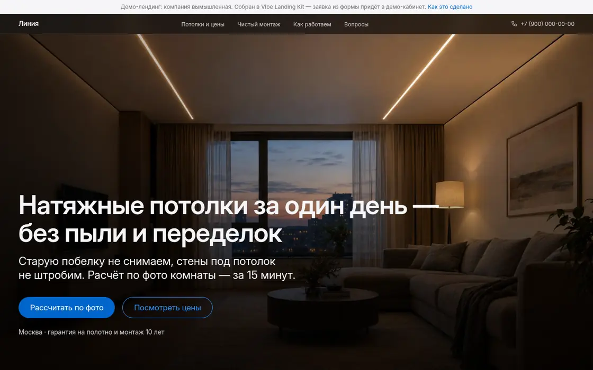</a><a href="https://lk.vibemarketolog.ru/w/potolki-liniya">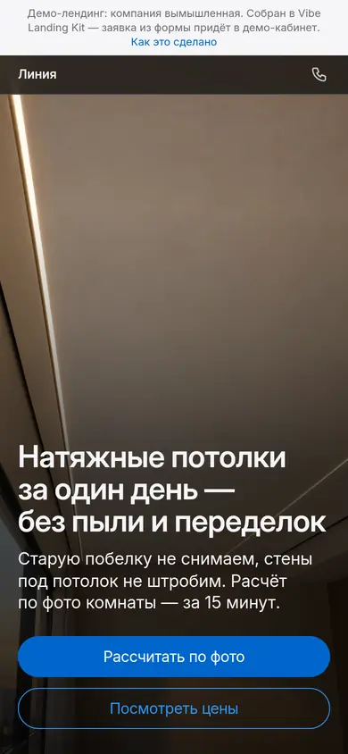</a></td><td valign="top"><b><a href="https://lk.vibemarketolog.ru/w/potolki-liniya">Линия — натяжные потолки</a></b><br><sub>Натяжные потолки, Москва · «натяжные потолки» — 1 317 124 показов/мес · стиль <a href="design-systems/apple/DESIGN.md">Apple</a></sub><br><br><b>Гипотеза.</b> Оффер «за один день без пыли» против «от 590 ₽ за м² с монтажом».<br><b>Медиа.</b> Кадры гостиной со световыми линиями, теневого зазора и кухни (gpt-image-2.5), липкий кадр со сменой преимуществ в духе Apple.<br><br><a href="https://lk.vibemarketolog.ru/w/potolki-liniya?v=a">Вариант A</a> · <a href="https://lk.vibemarketolog.ru/w/potolki-liniya?v=b">Вариант Б</a></td></tr>
<tr><td width="58%" valign="top"><a href="https://lk.vibemarketolog.ru/w/avtoservis-grafit">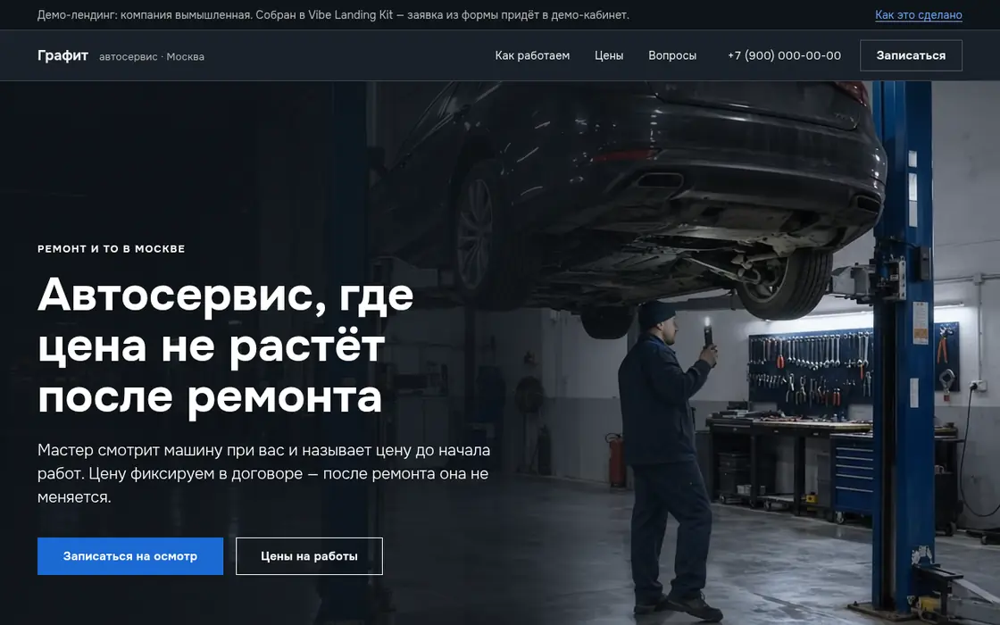</a><a href="https://lk.vibemarketolog.ru/w/avtoservis-grafit">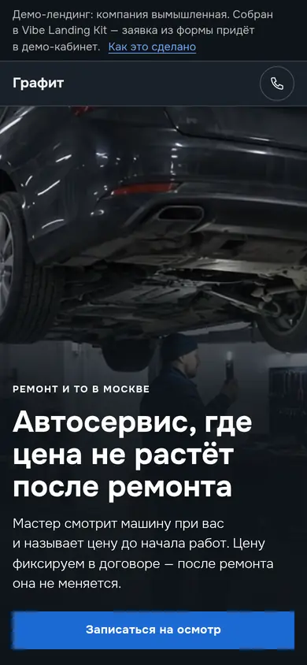</a></td><td valign="top"><b><a href="https://lk.vibemarketolog.ru/w/avtoservis-grafit">Графит — автосервис</a></b><br><sub>Ремонт и ТО, Москва · «автосервис» — 1 151 351 показов/мес · стиль <a href="design-systems/bmw/DESIGN.md">BMW</a></sub><br><br><b>Гипотеза.</b> Оффер «цена не растёт после ремонта» против «ремонт за один день и видео с подъёмника».<br><b>Медиа.</b> Ночная мастерская оживлена Omni и замирает на последнем кадре; мастер Андрей — один персонаж на портрете и в ролике с русской речью (голос закреплён за персонажем).<br><br><a href="https://lk.vibemarketolog.ru/w/avtoservis-grafit?v=a">Вариант A</a> · <a href="https://lk.vibemarketolog.ru/w/avtoservis-grafit?v=b">Вариант Б</a></td></tr>
<tr><td width="58%" valign="top"><a href="https://lk.vibemarketolog.ru/w/salon-na-moike">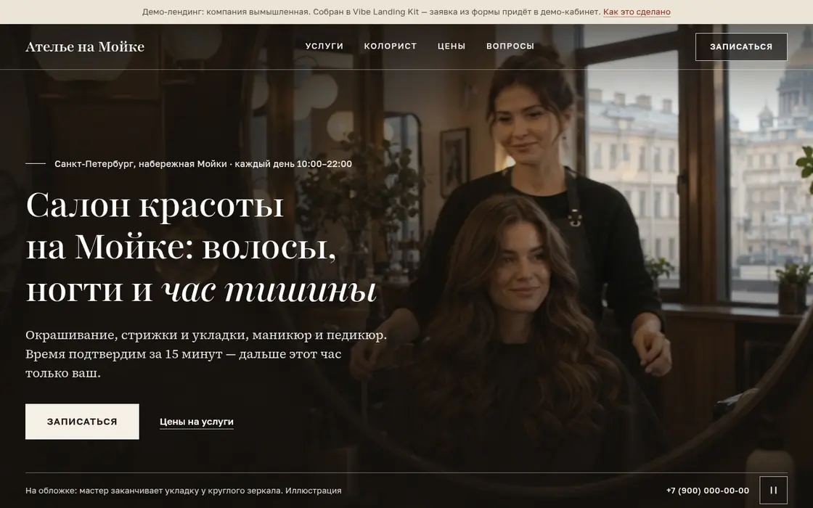</a><a href="https://lk.vibemarketolog.ru/w/salon-na-moike">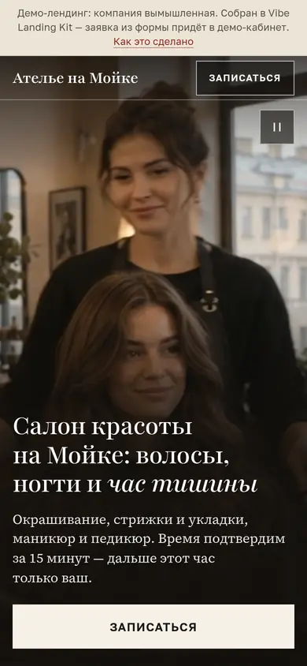</a></td><td valign="top"><b><a href="https://lk.vibemarketolog.ru/w/salon-na-moike">Ателье на Мойке — салон красоты</a></b><br><sub>Волосы, ногти, Санкт-Петербург · «салон красоты» — 1 139 180 показов/мес · стиль <a href="design-systems/editorial/DESIGN.md">Журнал</a></sub><br><br><b>Гипотеза.</b> Оффер «волосы, ногти и час тишины» против «колорист подбирает оттенок до окрашивания».<br><b>Медиа.</b> Журнальная обложка — ролик Omni из кадра с круглым зеркалом, фото-эссе (gpt-image-2.5).<br><br><a href="https://lk.vibemarketolog.ru/w/salon-na-moike?v=a">Вариант A</a> · <a href="https://lk.vibemarketolog.ru/w/salon-na-moike?v=b">Вариант Б</a></td></tr>
<tr><td width="58%" valign="top"><a href="https://lk.vibemarketolog.ru/w/cvety-pionovyi-dvor">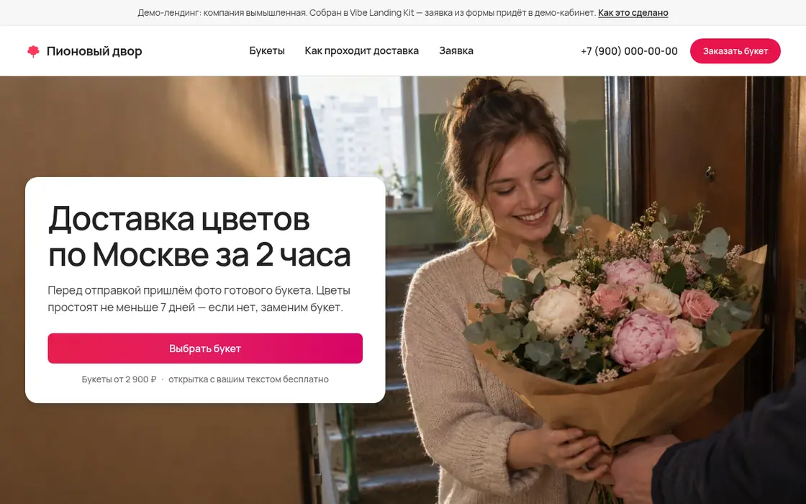</a><a href="https://lk.vibemarketolog.ru/w/cvety-pionovyi-dvor">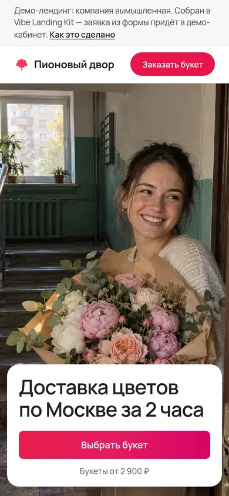</a></td><td valign="top"><b><a href="https://lk.vibemarketolog.ru/w/cvety-pionovyi-dvor">Пионовый двор — доставка цветов</a></b><br><sub>Доставка цветов по Москве · «доставка цветов» — 891 858 показов/мес · стиль <a href="design-systems/airbnb/DESIGN.md">Airbnb</a></sub><br><br><b>Гипотеза.</b> Главная кнопка «Выбрать букет» против «Получить фото букета до отправки».<br><b>Медиа.</b> Документальный кадр доставки и вертикальный для телефона, четыре букета для карточек каталога (gpt-image-2.5).<br><br><a href="https://lk.vibemarketolog.ru/w/cvety-pionovyi-dvor?v=a">Вариант A</a> · <a href="https://lk.vibemarketolog.ru/w/cvety-pionovyi-dvor?v=b">Вариант Б</a></td></tr>
</table>

## Медиа на первом экране

<table><tr><td valign="middle">Атмосферу продаёт первый кадр, а не абзац текста. Навык <code>landing-media</code> ведёт агента по конвейеру: сначала выверенный кадр <b>gpt-image-2.5</b> (с отдельным вертикальным для телефона), потом его оживление в <b>Gemini Omni</b> — постер и первый кадр ролика совпадают, вспышки при загрузке нет. Персонаж или маскот заводится один раз и говорит одним голосом по-русски во всех роликах лендинга. Для долгих решений — аудиоверсия страницы тем же голосом.</td><td width="170" align="center"></td></tr></table>

| Что | Как | Цена |
|---|---|---|
| Кадр первого экрана и секций | `gpt-image-2.5-flare`, язык документальной съёмки, место под заголовок задаётся композицией | 16 ₽ |
| Логотип или маскот в кадре | `gpt-image-2.5-flare-edit` с вашим файлом — логотип не перерисовывается | 22 ₽ |
| Персонаж на все ролики | голос-пресет `gemini-omni-audio` → персонаж `gemini-omni-character` по портрету | 39 + 49 ₽ |
| Видео | `gemini-omni-video` 720p, до 10 с: фон-петля из кадра или обращение персонажа с точной репликой | 149 ₽ |
| Аудиоверсия страницы | `gemini-flash-tts` тем же голосом, что у персонажа | 13 ₽ за 1000 знаков |

Где ставить видео, решает стиль: блок `media` каждой дизайн-системы повторяет приём бренда — у Apple фильм по кнопке и липкие секции, у BMW разделённые экраны «кадр + факт», у Airbnb ролик хозяина в его блоке, у журнального стиля фото-эссе. Тихие петли собираются «вперёд и назад» без шва, люди в кадре играют один раз и замирают, ролик со звуком — только по кнопке и с субтитрами.

> [!IMPORTANT]
> Против нейрослопа: каждый кадр смотрят глазами до оживления, речь в каждом ролике проверяют распознаванием. В примерах выше две реплики из трёх модель испортила повтором — их поймал этот шаг, и на страницы они не попали. Приёмы и готовые блоки — [skills/landing-media](skills/landing-media/SKILL.md).

## Гипотеза под ключ

<table><tr><td valign="middle">Лендинг, собранный агентом у вас на компьютере, становится работающей гипотезой одной командой <code>landing_launch</code>: адрес на <code>lk.vibemarketolog.ru/w/…</code>, форма сама отправляет заявки в кабинет, Telegram и на почту, трафик делится 50/50 между вариантами на одном адресе, статистика и вердикт по значимости считаются у нас, а сразу после запуска уходит проверочная заявка — видно, что доставка работает.</td><td width="170" align="center"></td></tr></table>

| Шаг | Инструмент | Цена |
|---|---|---|
| Паспорт: настоящий браузер на 1280/390/360 px — скролл на телефоне, кнопка на первом экране, форма с согласием 152-ФЗ, CDN, медиа, читаемость | `landing_check` | бесплатно |
| Запуск: адрес, заявки, A/B-тест, проверочная заявка. Паспорт не пройден — деньги не списываются | `landing_launch` | 990 ₽ |
| Правки варианта A или Б | `landing_update` | бесплатно |
| Итоги: визиты, заявки, конверсия, вердикт, сколько ещё нужно | `landing_status` | бесплатно |
| Про-версия победителя: полный сайт по выигравшему варианту | `landing_pro` | до 4 500 ₽ |

## Библиотека навыков

<table><tr><td valign="middle">12 навыков ведут агента по всей работе — от формулировки гипотезы до рекламы под варианты. В Claude Code они ставятся плагином, в ChatGPT, Claude.ai и Cursor приходят с MCP-сервера готовыми сценариями. Всё авторское проверено на живых страницах: формулы выборки пересчитаны и сверены симуляцией, шаблоны формы и сплита открыты в браузере, законы сверены с первоисточниками.</td><td width="170" align="center">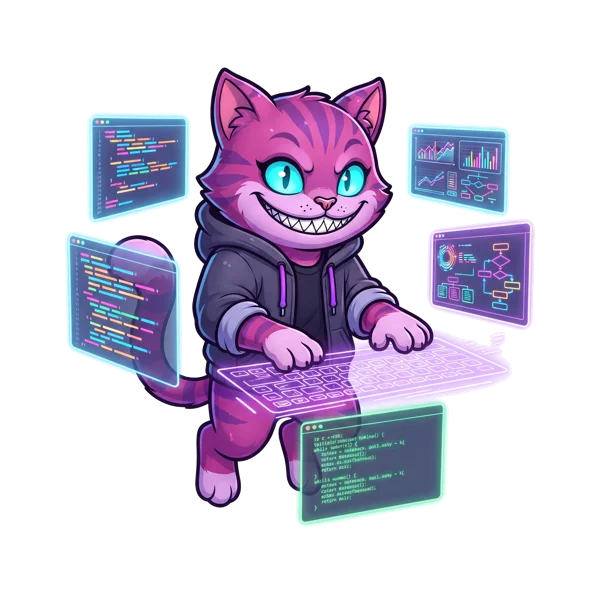</td></tr></table>

| Навык | Что даёт |
|---|---|
| [`landing-ab`](skills/landing-ab/SKILL.md) | Главный маршрут: от гипотезы до запущенного теста |
| [`hypothesis-lab`](skills/hypothesis-lab/SKILL.md) | Гипотеза «если — то — потому что», ICE/PIE, выборка и бюджет, A/A-тест, вердикт без подглядывания |
| [`landing-brief`](skills/landing-brief/SKILL.md) | Бриф A–G до вёрстки, «зерно дизайна» против шаблонности, 21 раскладка секций, ревью по 14 пунктам |
| [`design-system`](skills/design-system/SKILL.md) | Стиль из каталога: токены обеих тем, шрифты с кириллицей, компоненты |
| [`brand-to-system`](skills/brand-to-system/SKILL.md) | Свой стиль из брендбука клиента в формате каталога, с проверкой контраста |
| [`semantics`](skills/semantics/SKILL.md) | Заголовки, FAQ и минус-слова из Яндекс Вордстата |
| [`landing-media`](skills/landing-media/SKILL.md) | Кадр первого экрана, персонаж на все ролики, видео с русской речью, аудиоверсия |
| [`motion`](skills/motion/SKILL.md) | Анимации с режимом «меньше движения» |
| [`landing-mobile`](skills/landing-mobile/SKILL.md) | Телефон: чек-лист из 30 пунктов, iOS 26/27, Android, встроенные браузеры ВК и Telegram |
| [`landing-law-ru`](skills/landing-law-ru/SKILL.md) | 152-ФЗ, закон о рекламе, модерация Директа и ВК — шаблоны согласия и политики |
| [`landing-chatbot`](skills/landing-chatbot/SKILL.md) | Чат-бот с ИИ на странице: обучение по FAQ и сайту, виджет в цвет стиля |
| [`ad-match`](skills/ad-match/SKILL.md) | Реклама под варианты: объявление обещает то же, что первый экран; автостоп |

## Телефон: iOS 26/27 и Android

Из рекламы на лендинг приходят с телефона — 70–85 % визитов. Навык [`landing-mobile`](skills/landing-mobile/SKILL.md) собирает то, что реально меняется на экране, и помечает, что подтверждено Apple и WebKit, что — сообществом, а что — слухи:

| Что | Почему |
|---|---|
| `html, body` с цветом фона | iOS 26 больше не красит панели по `theme-color`: цвет берётся из фона страницы и прижатых к краю слоёв; прозрачный корень даёт белые полосы |
| Первый экран `100svh`, кнопка видна на 360×740, 320×640 и боком 844×390 | половина посетителей рекламы до кнопки не долистает |
| Поля от 16 px, `type="tel"`, `autocomplete="tel"` | мельче 16 px iOS увеличивает страницу при фокусе; номер подставляется одним касанием |
| Липкая кнопка прячется у формы и при открытой клавиатуре | иначе она закрывает поле, в которое человек пишет |
| Видео `muted playsinline` и постер со смыслом | в режиме энергосбережения автозапуска нет вовсе — остаётся только постер |
| Safari 27: `sizes="auto"`, привязка прокрутки | картинки нужного размера и страница без прыжков при догрузке |

Отдельной «адаптации под iOS 27» в CSS не существует: достаточно пережить Liquid Glass из Safari 26 и взять новые возможности Safari 27. Паспорт проверяет это автоматически — на сервере (`landing_check`) и у вас на компьютере: `node tools/passport.mjs index.html b.html` (Playwright, 36 проверок, без сети и денег). Что видно только на живом телефоне — в конце навыка протокол на 10 минут.

## Чат-бот с ИИ на лендинге

<table><tr><td valign="middle">Часть посетителей рекламы не готова оставить телефон, но готова спросить. Консультант с ИИ отвечает по базе знаний страницы, зовёт живого оператора и забирает контакт. Агент создаёт бота, учит его вопросам и ценам со страницы, красит виджет в цвет главной кнопки стиля и ставит одну строку кода одинаково в A и Б. Уведомления о вопросах — в кабинет и Telegram.</td><td width="170" align="center"></td></tr></table>

| Шаг | Инструмент | Цена |
|---|---|---|
| Создать бота для сайта | `chatbot_create_site` | бесплатно |
| Научить: пункт FAQ или текст · страница сайта · весь сайт | `chatbot_learn`, `chatbot_learn_site` | 5 ₽ · 10 ₽ · 4 ₽ за страницу (до 30) |
| Вид и код виджета | `chatbot_widget` | бесплатно |
| Ответ посетителю | — | от 2 ₽ за ответ, без абонплаты |
| Диалоги, ответ от имени оператора | `chatbot_conversations`, `chatbot_status` | бесплатно |

## Что внутри

### Дизайн-системы

<table><tr><td valign="middle">Каждая запись — всё, что нужно агенту, чтобы сверстать страницу без вопросов: токены обеих тем, шрифты, компоненты, раскладку лендинга, форму заявки, правила A/B-теста и правила медиа бренда.</td><td width="170" align="center"></td></tr></table>

| | |
|---|---|
| **Токены** | цвета светлой и тёмной темы по ролям, типографика для десктопа и телефона, радиусы, отступы, тени, движение |
| **Контраст** | каждая пара «текст — фон» проверена по WCAG в обеих темах: текст ≥ 7, остальное ≥ 4.5 |
| **Шрифты** | только свободные OFL-шрифты с кириллицей из Fontsource — вместо фирменных, которые нельзя распространять |
| **Лендинг** | первый экран, порядок секций, форма заявки с согласием 152-ФЗ, мобильная раскладка |
| **Медиа** | что бренд ставит на первый экран, где видео ниже, уместен ли персонаж и аудиоверсия, чего избегать |
| **A/B-тест** | что можно менять между вариантами и что обязано остаться неизменным |
| **Правила** | do / don't и готовая инструкция верстальщику |

| Стиль | Для кого | Шрифты с кириллицей |
|---|---|---|
| [Бенто](design-systems/bento/DESIGN.md) *(свой стиль)* | SaaS для малого бизнеса, онлайн-касса, учёт, CRM, онлайн-сервисы и мобильные приложения | Commissioner |
| [Тёмный премиум](design-systems/dark-premium/DESIGN.md) *(свой стиль)* | элитная и бизнес-недвижимость, новостройки и загородные посёлки, премиальные автомобили и автосалоны | Cormorant, Manrope |
| [Журнал](design-systems/editorial/DESIGN.md) *(свой стиль)* | рестораны, кафе, бары и кофейни, пекарни и кондитерские, эксперты, консультанты и частные практики | Playfair, Source Serif 4, Golos Text |
| [Необрутализм](design-systems/neobrutal/DESIGN.md) *(свой стиль)* | промо-акции и распродажи, ивенты, фестивали и вечеринки, молодёжные курсы и интенсивы | Unbounded, Rubik |
| [Мягкий](design-systems/soft/DESIGN.md) *(свой стиль)* | медицинские клиники и стоматология, косметология и салоны красоты, детские центры, кружки и сады | Lora, Nunito |
| [Швейцарский](design-systems/swiss/DESIGN.md) *(свой стиль)* | юридические услуги и адвокаты, консалтинг и аудит, бухгалтерия и налоги | Geist, Geist Mono |
| [Терракота](design-systems/terracotta/DESIGN.md) *(свой стиль)* | кафе и рестораны, пекарни и кондитерские, кейтеринг и доставка домашней еды | Alegreya, Nunito Sans |
| [Airbnb](design-systems/airbnb/DESIGN.md) | аренда жилья и туризм, гостиницы, глэмпинги, базы отдыха, экскурсии и впечатления | Manrope |
| [Apple](design-systems/apple/DESIGN.md) | премиальные товары и техника, гаджеты и электроника, мобильные приложения и SaaS | Inter |
| [BMW](design-systems/bmw/DESIGN.md) | автосалоны и дилерские центры, автосервис, детейлинг, шиномонтаж премиум-класса, инженерные и промышленные компании | Onest |
| [Cal.com](design-systems/cal/DESIGN.md) | онлайн-запись и сервисы бронирования, консультации: юристы, бухгалтеры, психологи, B2B SaaS и IT-сервисы | Manrope, Inter |
| [Clay](design-systems/clay/DESIGN.md) | детские центры и развивающие занятия, частные детские сады и школы, кружки, студии, летние лагеря | M PLUS Rounded 1c, Inter |
| [ElevenLabs](design-systems/elevenlabs/DESIGN.md) | эстетическая медицина и косметология, дерматология и трихология, психотерапия и психологическая помощь | Spectral, Inter |
| [IBM](design-systems/ibm/DESIGN.md) | промышленное оборудование и производство, инжиниринг, проектирование и монтаж инженерных систем, логистика, склады и грузоперевозки для бизнеса | IBM Plex Sans, IBM Plex Mono, IBM Plex Serif |
| [Intercom](design-systems/intercom/DESIGN.md) | SaaS и облачные сервисы, клиентский сервис и поддержка, ИИ-ассистенты и чат-боты | Geist, Geist Mono |
| [Linear](design-systems/linear/DESIGN.md) | SaaS и IT-продукты, B2B-сервисы, разработка и внедрение | Inter, JetBrains Mono |
| [Miro](design-systems/miro/DESIGN.md) | онлайн-школы и курсы, тренинги, интенсивы и марафоны, корпоративное обучение | Onest |
| [Nike](design-systems/nike/DESIGN.md) | спорт и фитнес-клубы, одежда, обувь и снаряжение, школы и секции для детей и взрослых | Sofia Sans Condensed, Inter |
| [Notion](design-systems/notion/DESIGN.md) | SaaS и сервисы для команд, онлайн-школы и курсы, агентства и студии | Inter |
| [Pinterest](design-systems/pinterest/DESIGN.md) | ремонт и дизайн интерьера, кухни и мебель на заказ, маникюр, брови, визаж и другие бьюти-мастера | Golos Text |
| [Renault](design-systems/renault/DESIGN.md) | автосалоны и продажа авто с пробегом, шины, диски и шиномонтаж, прокат и аренда автомобилей | Sofia Sans Semi Condensed |
| [Revolut](design-systems/revolut/DESIGN.md) | финтех и банковские продукты, мобильные приложения, подписки и тарифы | Onest, Inter |
| [Shopify](design-systems/shopify/DESIGN.md) | интернет-магазины и запуск e-commerce, D2C-бренды и производители со своим продуктом, выход на маркетплейсы и продажи в соцсетях | Inter |
| [Stripe](design-systems/stripe/DESIGN.md) | финтех и платежи, SaaS и B2B-сервисы, эквайринг, онлайн-кассы, бухгалтерия | Inter Tight, Inter |
| [Tesla](design-systems/tesla/DESIGN.md) | автосалоны, автоподбор и продажа авто с пробегом, новостройки и коттеджные посёлки, загородные дома под ключ | Montserrat, Inter |
| [Uber](design-systems/uber/DESIGN.md) | клининг и уборка квартир и офисов, переезды, грузчики, вывоз мусора, доставка цветов, продуктов, стройматериалов | Wix Madefor Display, Wix Madefor Text |
| [Vodafone](design-systems/vodafone/DESIGN.md) | интернет-провайдеры и домашнее ТВ, мобильная связь и тарифы для бизнеса, акции, распродажи и сезонные предложения | Geologica |
| [Wise](design-systems/wise/DESIGN.md) | финтех и переводы денег, платёжные и банковские сервисы, бухгалтерия и налоги | Inter Tight, Inter |
| [Zapier](design-systems/zapier/DESIGN.md) | малый бизнес и услуги для предпринимателей, бухгалтерия, налоги, регистрация ИП и ООО, окна, натяжные потолки, двери, жалюзи | Wix Madefor Display, Inter |

### Анимации

<table><tr><td valign="middle">Готовые рецепты: разметка, CSS и ванильный JS без внешних библиотек. Анимируются только <code>transform</code> и <code>opacity</code>, первый экран не ждёт скриптов, у каждого рецепта есть режим «меньше движения» (<code>prefers-reduced-motion</code>), у бесконечных — пауза.</td><td width="170" align="center"></td></tr></table>

| Рецепт | Где на лендинге | «Меньше движения» |
|---|---|---|
| [`counter-up`](motion/counter-up.json) — Счётчик цифр при появлении в кадре | блок результатов в цифрах, доверие: клиенты, заявки, годы работы | смягчается до появления |
| [`fade-up-stagger`](motion/fade-up-stagger.json) — Появление снизу по очереди | карточки преимуществ, шаги «как это работает» | смягчается до появления |
| [`image-reveal-clip`](motion/image-reveal-clip.json) — Проявление картинки шторкой clip-path | скриншоты продукта и отчётов, превью кейсов «было — стало» | смягчается до появления |
| [`result-bars`](motion/result-bars.json) — Полосы «было → стало» с синхронным счётом | кейс в цифрах: цена заявки, число заявок, конверсия до и после, сравнение «сами / с нами» | выключается |
| [`hero-text-reveal`](motion/hero-text-reveal.json) — Проявление заголовка первого экрана построчно через маску | заголовок h1 первого экрана из 2–4 строк, короткий оффер с цифрой или сроком («Заявки уже с первого дня») | смягчается до появления |
| [`hero-word-rotator`](motion/hero-word-rotator.json) — Сменное слово в заголовке первого экрана | заголовок первого экрана с перечнем ниш или аудиторий, «для [кого]» в оффере сервиса с несколькими сегментами | выключается |
| [`marker-highlight`](motion/marker-highlight.json) — Маркер под главной фразой | главная выгода в оффере или подзаголовке первого экрана, обещание перед формой заявки | выключается |
| [`svg-line-draw`](motion/svg-line-draw.json) — Рисованная линия: подчёркивание, обводка, стрелка к кнопке | подчёркнуть 1–3 слова оффера (в том числе в заголовке первого экрана), обвести цифру: скидка, срок, гарантия, «бесплатно» | выключается |
| [`media-zoom-scroll`](motion/media-zoom-scroll.json) — Кадр продукта вырастает по прокрутке | главный скрин интерфейса или отчёта, кадр готового результата (интерьер, сайт, упаковка) | выключается |
| [`parallax-soft`](motion/parallax-soft.json) — Мягкий параллакс фона и иллюстрации | фон первого экрана, иллюстрация рядом с оффером | выключается |
| [`scroll-progress-bar`](motion/scroll-progress-bar.json) — Полоса прогресса чтения страницы | длинные лендинги с формой в конце, лонгриды, кейсы и разборы | остаётся |
| [`scroll-story-steps`](motion/scroll-story-steps.json) — Шаги «как это работает» с липким кадром | «как это работает» в 3–4 шага, как устроен продукт: экран за экраном | смягчается до появления |
| [`steps-progress-line`](motion/steps-progress-line.json) — Линия прогресса по шагам процесса | «как мы работаем» в 3–6 шагов, этапы проекта и сроки | выключается |
| [`sticky-cta-mobile`](motion/sticky-cta-mobile.json) — Липкая кнопка заявки на телефоне | длинные рекламные лендинги с формой внизу, страницы услуг, где решение созревает на середине прокрутки | смягчается до появления |
| [`sticky-stack-cards`](motion/sticky-stack-cards.json) — Стопка карточек, наезжающих при прокрутке | преимущества (3–5 карточек), шаги «как мы работаем» | выключается |
| [`text-scroll-highlight`](motion/text-scroll-highlight.json) — Абзац «боли» проявляется по словам при прокрутке | абзац «боли» или «знакомо?» перед решением, манифест или главная мысль бренда | выключается |
| [`magnetic-button`](motion/magnetic-button.json) — Кнопка, притягивающаяся к курсору | главная кнопка первого экрана, кнопка отправки формы заявки | смягчается до появления |
| [`tilt-card`](motion/tilt-card.json) — Наклон карточки за курсором | карточки тарифов, карточки услуг и пакетов | выключается |
| [`accordion-smooth`](motion/accordion-smooth.json) — Плавное раскрытие FAQ на &lt;details&gt; | блок «Частые вопросы» перед формой заявки, ответы на возражения под тарифами | смягчается до появления |
| [`before-after-slider`](motion/before-after-slider.json) — Слайдер «до и после» | ремонт и отделка, клининг, химчистка, детейлинг авто | смягчается до появления |
| [`form-field-feedback`](motion/form-field-feedback.json) — Понятная ошибка поля формы | форма заявки: имя, телефон, согласие, запись на консультацию или замер | смягчается до появления |
| [`form-success`](motion/form-success.json) — Анимация успешной отправки формы заявки | форма заявки внизу лендинга, форма «Получить расчёт» в модальном окне | смягчается до появления |
| [`tabs-indicator`](motion/tabs-indicator.json) — Вкладки и переключатель «месяц / год» с переезжающей подложкой | тарифы: помесячно / за год со скидкой, вкладки «для кафе / для салона / для магазина» | смягчается до появления |
| [`cta-attention`](motion/cta-attention.json) — Привлечение внимания к главной кнопке (ограниченное число повторов) | главная кнопка первого экрана, финальная кнопка перед формой заявки | смягчается до появления |
| [`gradient-drift`](motion/gradient-drift.json) — Медленно плывущий градиент фона с паузой | фон первого экрана, блок перед формой заявки | выключается |
| [`marquee-logos`](motion/marquee-logos.json) — Бесконечная лента логотипов и отзывов с паузой | логотипы клиентов под первым экраном, короткие отзывы перед формой заявки | выключается |

## Семантика из Яндекс Вордстата

Инструмент `build_semantics` собирает запросы Вордстата и раскладывает их по блокам лендинга: что писать в заголовке, в ценах, в вопросах и в кнопке. Живой пример «кухни на заказ в Казани», быстрый уровень — 100 фраз за 20 секунд:

| Блок | Группа | Показов в месяц | Примеры фраз |
|---|---|---|---|
| `hero` | Кухни на заказ в Казани | 1 101 | кухни на заказ казань, заказать кухонный гарнитур |
| `pricing` | Цены и недорогие кухни | 384 | кухня на заказ цена, кухни на заказ казань недорого |
| `proof` | Каталог, фото и отзывы | 228 | кухни на заказ казань каталог, от производителя |
| `faq` | Вопросы о кухнях на заказ | 55 | какие лучше, размеры |
| `lead_form` | Заявка и контакты | 35 | изготовление кухни на заказ |

Плюс минус-слова для рекламы (`доставка еды`, `пицца`, `авито`…), а на глубоком уровне — сезонность за 24 месяца и пары заголовков А/Б для каждой группы.

## Подключение

<table><tr><td valign="middle">Один MCP-сервер для всех: в Claude Code — плагином или одной командой, в ChatGPT и Claude — коннектором по адресу, в Cursor — строкой в настройках. Маршрут лендинга приходит и в ChatGPT с Claude.ai: сервер отдаёт все навыки библиотеки как готовые сценарии (MCP prompts).</td><td width="170" align="center"></td></tr></table>

| Где | Как |
|---|---|
| **Claude Code — плагин** | `/plugin marketplace add vibemarketologru/vibe-landing-kit` → `/plugin install vibe-landing@vibe-landing-kit` → `/mcp` → Authenticate |
| **Claude Code — только MCP** | `claude mcp add --transport http vibemarketolog https://lk.vibemarketolog.ru/mcp` |
| **ChatGPT, Claude.ai** | коннектор `https://lk.vibemarketolog.ru/mcp` — [видео-инструкции](https://lk.vibemarketolog.ru/connect?utm_source=github&utm_medium=readme&utm_campaign=vibe-landing-kit) |
| **Cursor, Windsurf, VS Code** | `mcp.json` с адресом сервера и ключом — [инструкция](https://lk.vibemarketolog.ru/connect?utm_source=github&utm_medium=readme&utm_campaign=vibe-landing-kit#other) |
| **Свой код** | REST: `/api/agent/design-systems`, `/motion`, `/semantics`, `/landings`, `/landings/check`, `/chatbots` — [документация](https://lk.vibemarketolog.ru/docs/agent-api?utm_source=github&utm_medium=readme&utm_campaign=vibe-landing-kit) |

Вход — через кабинет [Вайб-Маркетолога](https://vibemarketolog.ru?utm_source=github&utm_medium=readme&utm_campaign=vibe-landing-kit): новым пользователям начисляется бонус на баланс.

## Сколько стоит

| Что | Цена |
|---|---|
| Каталог дизайн-систем и анимаций, подбор стиля, паспорт лендинга, правки и итоги теста, этот репозиторий | бесплатно |
| Семантика для сайта | 49 ₽ быстрая · 149 ₽ глубокая |
| Вордстат: популярные запросы / динамика / регионы | 49 / 49 / 99 ₽ |
| Кадр gpt-image-2.5 · с логотипом по образцу | 16 ₽ · 22 ₽ |
| Видео Gemini Omni 720p · персонаж с голосом · аудиоверсия | 149 ₽ · 88 ₽ · 13 ₽ за 1000 знаков |
| Чат-бот с ИИ: обучение · ответ посетителю | от 5 ₽ · от 2 ₽ |
| Запуск гипотезы: адрес, заявки, A/B-тест | 990 ₽ |
| Про-версия победителя | до 4 500 ₽ |
| Отчёт Метрики, анализ кампаний Директа | 19 ₽ / 29–99 ₽ |

Оплата — с рублёвого баланса, только за сделанное, без подписки. Перед каждым платным шагом агент называет цену; дневной лимит подключения по умолчанию 500 ₽ и меняется в кабинете. Типичный лендинг из галереи: медиа 60–600 ₽ и 990 ₽ за запуск.

## Партнёрская программа

<table><tr><td valign="middle">Собираете лендинги клиентам — зарабатывайте на их работе в платформе. Пригласите клиента по своей ссылке: вы получаете <b>10 % с каждого его пополнения</b>, а по мере роста оборота приведённых ставка поднимается до <b>30 %</b>. Деньги копятся на отдельном партнёрском балансе: перевод на баланс кабинета — мгновенно, вывод деньгами — по заявке.</td><td width="170" align="center"></td></tr></table>

| Оборот приведённых | Ставка |
|---|---|
| старт | 10 % |
| от 10 000 ₽ | 15 % |
| от 50 000 ₽ | 20 % |
| от 150 000 ₽ | 25 % |
| от 300 000 ₽ | 30 % |

Ссылка и статистика — в кабинете: [lk.vibemarketolog.ru/partner](https://lk.vibemarketolog.ru/partner?utm_source=github&utm_medium=readme&utm_campaign=vibe-landing-kit). Ссылка работает на любой странице (`?ref=ваш-код`), человек закрепляется за вами на 30 дней. Начисление приходит после 14 дней удержания, возврат платежа его отменяет.

## Для разработчиков

- `node tools/check.mjs .` — проверка каталога: контраст WCAG в обеих темах, кириллица и лицензия шрифтов через Fontsource, reduced-motion и свойства анимаций, блок `media`, согласованность ссылок.
- `node tools/passport.mjs index.html b.html` — паспорт лендинга у вас на компьютере: те же блокирующие проверки, что у `landing_check`, плюс мобильные (Playwright, код выхода 1 — есть блокирующие).
- `python3 tools/build-readme.py` — этот README из `catalog.json` и `showcase.json`.
- Схема записи — [SCHEMA.md](SCHEMA.md), правила для агентов — [AGENTS.md](AGENTS.md), [llms.txt](llms.txt).

## Лицензии и товарные знаки

Код и каталог — [MIT](LICENSE). Записи вида «Stripe», «Apple» описывают эстетику и не аффилированы с брендами: без логотипов и фирменных шрифтов — подробнее в [TRADEMARKS.md](TRADEMARKS.md). Источники и их лицензии — [NOTICE.md](NOTICE.md). Компании в демо-лендингах вымышлены, медиа сгенерированы для примеров.

## Автор

**Владимир Дорецкий** — основатель [Вайб-Маркетолога](https://vibemarketolog.ru?utm_source=github&utm_medium=readme&utm_campaign=vibe-landing-kit). Telegram: [@CentrMedia](https://telegram.me/CentrMedia).

Вопросы и идеи — в Issues: там ответ увидят и другие.
