<div align="center">


# Vibe Landing Kit

**Лендинг для A/B-теста рекламы — одной командой агенту.**
16 дизайн-систем в духе мировых брендов и собственных стилей — с кириллицей, тёмной темой и проверенным контрастом,
16 анимаций, которые не ломают скорость и доступность, и семантика из Яндекс Вордстата.
Для Claude Code, ChatGPT, Claude и Cursor.

[](CHANGELOG.md)
[](LICENSE)
[](#галерея-один-лендинг--16-стилей)
[](#анимации)
[](#подключение)
[](https://lk.vibemarketolog.ru/connect)

**Русский** · [English](README.en.md)

</div>

---

## Одна команда

```text
/plugin marketplace add vibemarketologru/vibe-landing-kit
/plugin install vibe-landing@vibe-landing-kit
/landing Кухни на заказ в Казани. Гипотеза: «рассрочка 0%» против «монтаж за 21 день». Стиль как у Airbnb
```

Агент сам пройдёт весь путь и остановится перед каждым платным шагом, назвав цену:

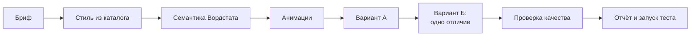

> [!TIP]
> Каталог работает и без подключения: каждая система лежит в репозитории как JSON, готовый `theme.css` для обеих тем и `DESIGN.md`. Передайте файл любому агенту — он сверстает страницу в этом стиле.

## Галерея: один лендинг — 16 стилей

Один и тот же лендинг, собранный из токенов каждой записи. Картинка следует теме GitHub: откройте в тёмной — увидите тёмный вариант.

<table>
<tr><td width="25%" valign="top"><a href="design-systems/dark-premium/DESIGN.md"><picture><source media="(prefers-color-scheme: dark)" srcset="assets/previews/dark-premium-dark-card.webp">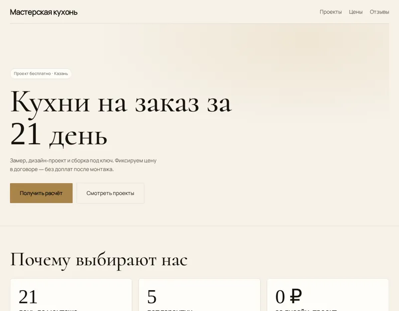</picture></a><br><sub><b>Тёмный премиум</b></sub></td><td width="25%" valign="top"><a href="design-systems/editorial/DESIGN.md"><picture><source media="(prefers-color-scheme: dark)" srcset="assets/previews/editorial-dark-card.webp">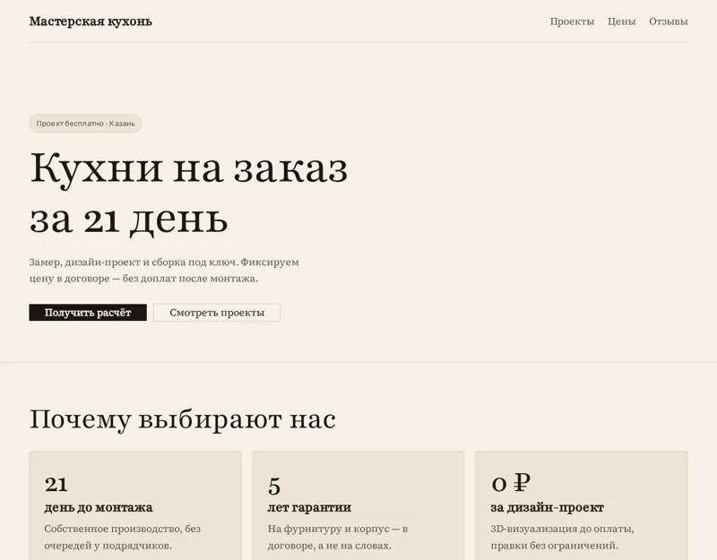</picture></a><br><sub><b>Журнал</b></sub></td><td width="25%" valign="top"><a href="design-systems/soft/DESIGN.md"><picture><source media="(prefers-color-scheme: dark)" srcset="assets/previews/soft-dark-card.webp">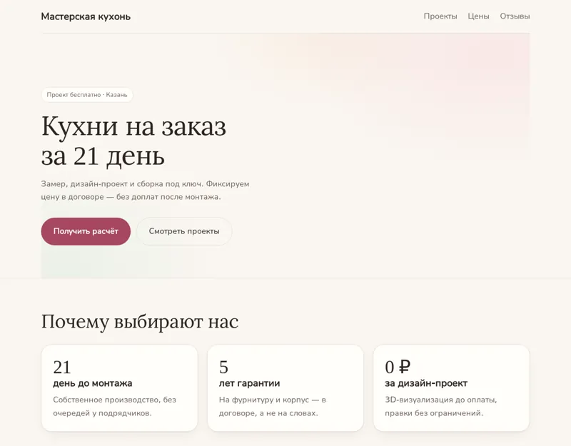</picture></a><br><sub><b>Мягкий</b></sub></td><td width="25%" valign="top"><a href="design-systems/swiss/DESIGN.md"><picture><source media="(prefers-color-scheme: dark)" srcset="assets/previews/swiss-dark-card.webp">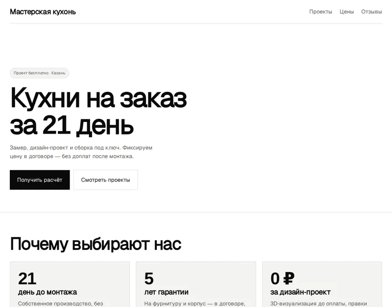</picture></a><br><sub><b>Швейцарский</b></sub></td></tr>
<tr><td width="25%" valign="top"><a href="design-systems/airbnb/DESIGN.md"><picture><source media="(prefers-color-scheme: dark)" srcset="assets/previews/airbnb-dark-card.webp">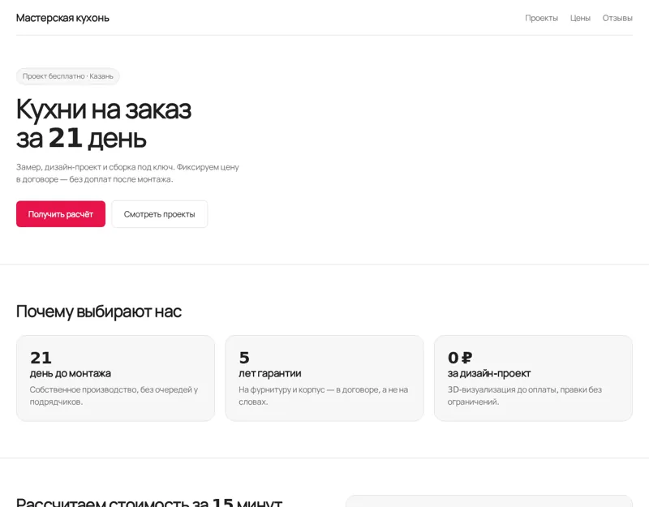</picture></a><br><sub><b>Airbnb</b></sub></td><td width="25%" valign="top"><a href="design-systems/apple/DESIGN.md"><picture><source media="(prefers-color-scheme: dark)" srcset="assets/previews/apple-dark-card.webp">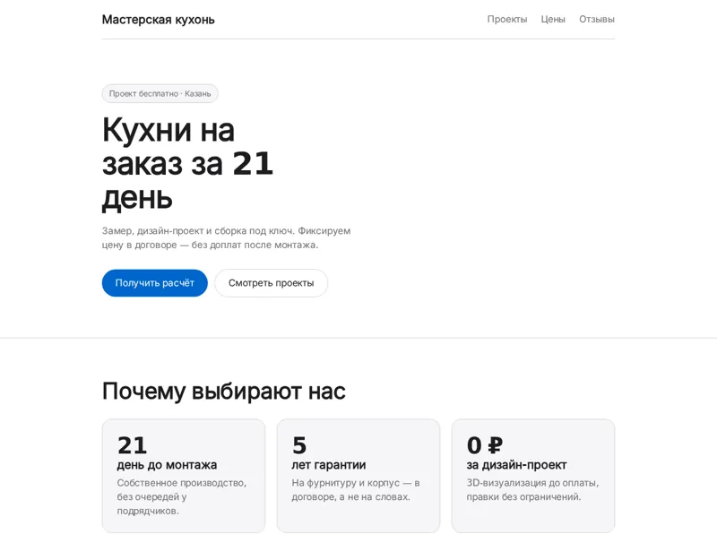</picture></a><br><sub><b>Apple</b></sub></td><td width="25%" valign="top"><a href="design-systems/bmw/DESIGN.md"><picture><source media="(prefers-color-scheme: dark)" srcset="assets/previews/bmw-dark-card.webp">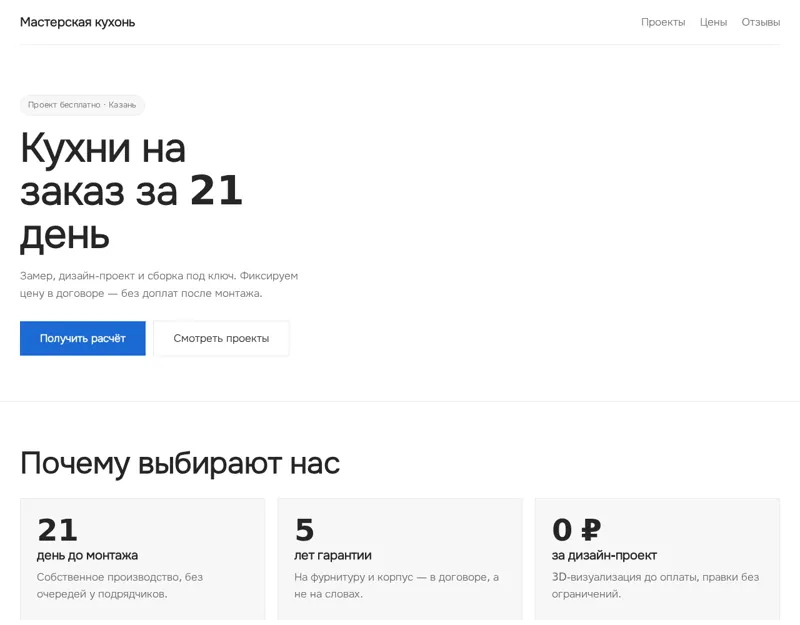</picture></a><br><sub><b>BMW</b></sub></td><td width="25%" valign="top"><a href="design-systems/cal/DESIGN.md"><picture><source media="(prefers-color-scheme: dark)" srcset="assets/previews/cal-dark-card.webp">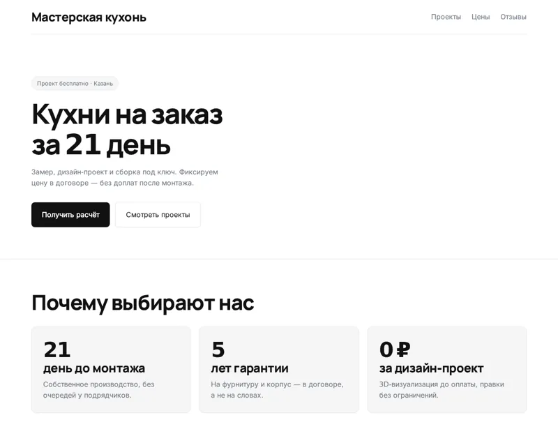</picture></a><br><sub><b>Cal.com</b></sub></td></tr>
<tr><td width="25%" valign="top"><a href="design-systems/intercom/DESIGN.md"><picture><source media="(prefers-color-scheme: dark)" srcset="assets/previews/intercom-dark-card.webp">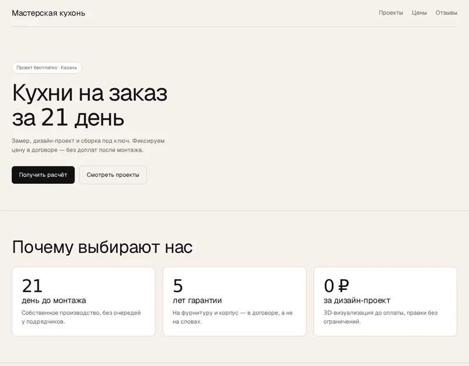</picture></a><br><sub><b>Intercom</b></sub></td><td width="25%" valign="top"><a href="design-systems/linear/DESIGN.md"><picture><source media="(prefers-color-scheme: dark)" srcset="assets/previews/linear-dark-card.webp">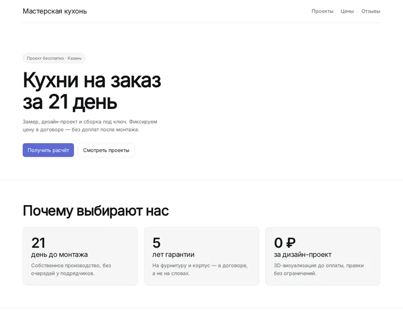</picture></a><br><sub><b>Linear</b></sub></td><td width="25%" valign="top"><a href="design-systems/nike/DESIGN.md"><picture><source media="(prefers-color-scheme: dark)" srcset="assets/previews/nike-dark-card.webp">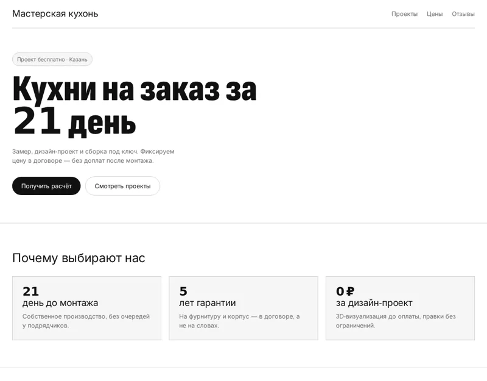</picture></a><br><sub><b>Nike</b></sub></td><td width="25%" valign="top"><a href="design-systems/notion/DESIGN.md"><picture><source media="(prefers-color-scheme: dark)" srcset="assets/previews/notion-dark-card.webp">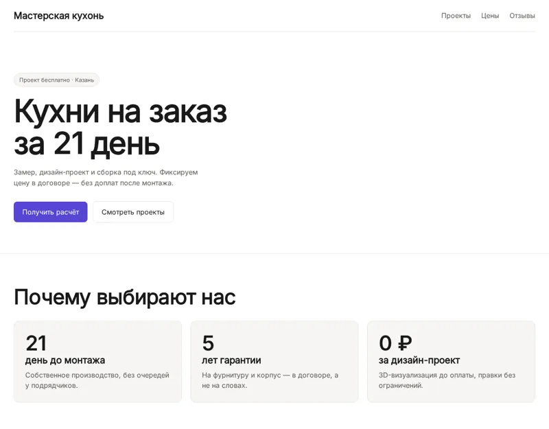</picture></a><br><sub><b>Notion</b></sub></td></tr>
<tr><td width="25%" valign="top"><a href="design-systems/revolut/DESIGN.md"><picture><source media="(prefers-color-scheme: dark)" srcset="assets/previews/revolut-dark-card.webp">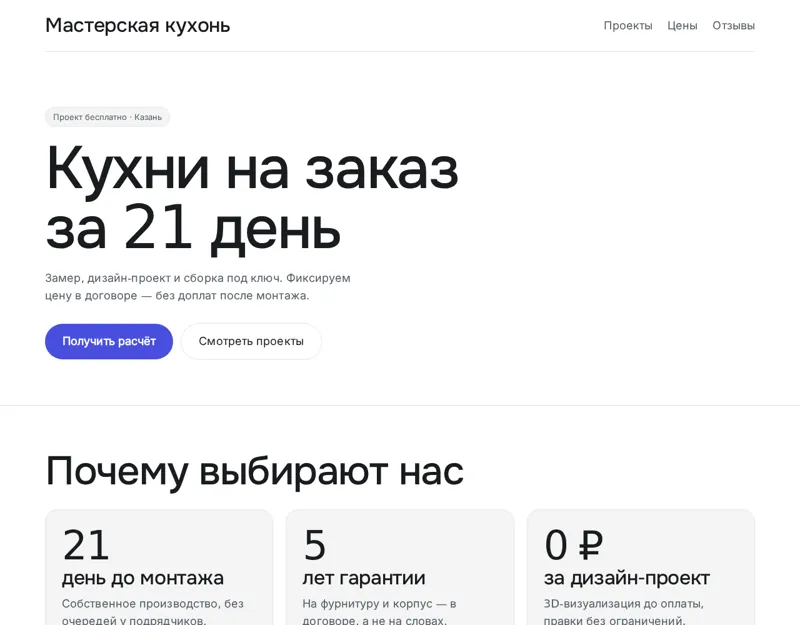</picture></a><br><sub><b>Revolut</b></sub></td><td width="25%" valign="top"><a href="design-systems/shopify/DESIGN.md"><picture><source media="(prefers-color-scheme: dark)" srcset="assets/previews/shopify-dark-card.webp">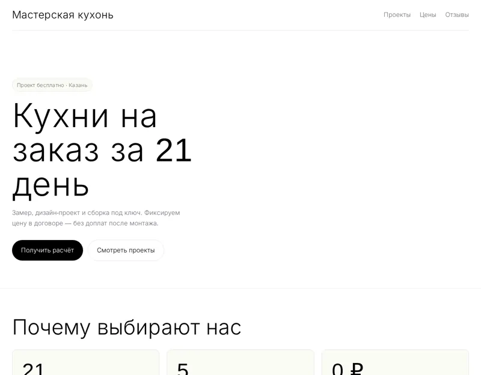</picture></a><br><sub><b>Shopify</b></sub></td><td width="25%" valign="top"><a href="design-systems/stripe/DESIGN.md"><picture><source media="(prefers-color-scheme: dark)" srcset="assets/previews/stripe-dark-card.webp">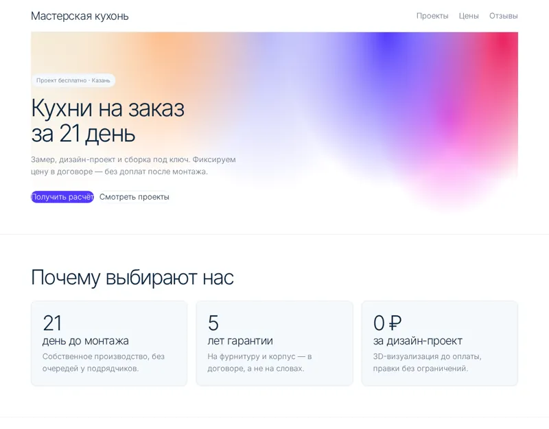</picture></a><br><sub><b>Stripe</b></sub></td><td width="25%" valign="top"><a href="design-systems/wise/DESIGN.md"><picture><source media="(prefers-color-scheme: dark)" srcset="assets/previews/wise-dark-card.webp">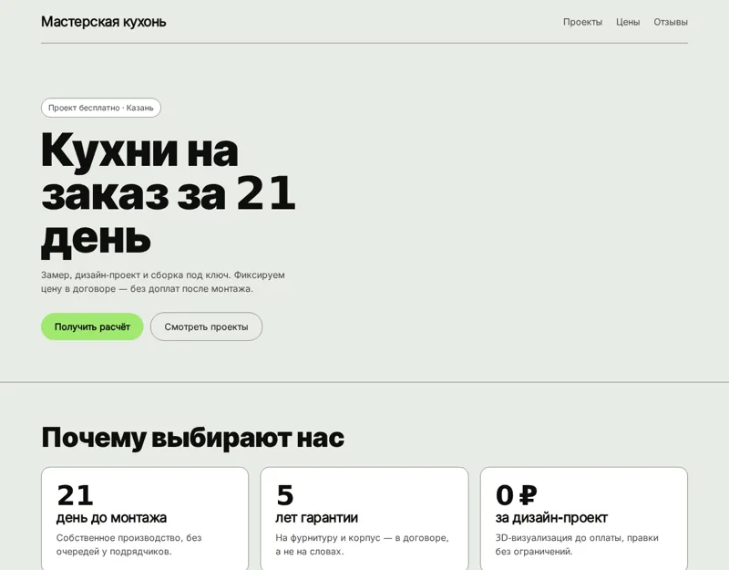</picture></a><br><sub><b>Wise</b></sub></td></tr>
</table>

## Что внутри

### Дизайн-системы

<table><tr><td valign="middle">Каждая запись — это не описание «в общих словах», а всё, что нужно агенту, чтобы сверстать страницу без вопросов: токены обеих тем, шрифты, компоненты, раскладку лендинга, форму заявки и правила A/B-теста.</td><td width="170" align="center"></td></tr></table>

| | |
|---|---|
| **Токены** | цвета светлой и тёмной темы по ролям, типографика для десктопа и телефона, радиусы, отступы, тени, движение |
| **Контраст** | каждая пара «текст — фон» проверена по WCAG в обеих темах: текст ≥ 7, остальное ≥ 4.5 |
| **Шрифты** | только свободные OFL-шрифты с кириллицей из Fontsource — вместо фирменных, которые нельзя распространять |
| **Лендинг** | первый экран, порядок секций, форма заявки с согласием 152-ФЗ, мобильная раскладка |
| **A/B-тест** | что можно менять между вариантами и что обязано остаться неизменным |
| **Правила** | do / don't и готовая инструкция верстальщику |

| Стиль | Для кого | Шрифты с кириллицей |
|---|---|---|
| [Тёмный премиум](design-systems/dark-premium/DESIGN.md) *(свой стиль)* | элитная и бизнес-недвижимость, новостройки и загородные посёлки, премиальные автомобили и автосалоны | Cormorant, Manrope |
| [Журнал](design-systems/editorial/DESIGN.md) *(свой стиль)* | рестораны, кафе, бары и кофейни, пекарни и кондитерские, эксперты, консультанты и частные практики | Playfair, Source Serif 4, Golos Text |
| [Мягкий](design-systems/soft/DESIGN.md) *(свой стиль)* | медицинские клиники и стоматология, косметология и салоны красоты, детские центры, кружки и сады | Lora, Nunito |
| [Швейцарский](design-systems/swiss/DESIGN.md) *(свой стиль)* | юридические услуги и адвокаты, консалтинг и аудит, бухгалтерия и налоги | Geist, Geist Mono |
| [Airbnb](design-systems/airbnb/DESIGN.md) | аренда жилья и туризм, гостиницы, глэмпинги, базы отдыха, экскурсии и впечатления | Manrope |
| [Apple](design-systems/apple/DESIGN.md) | премиальные товары и техника, гаджеты и электроника, мобильные приложения и SaaS | Inter |
| [BMW](design-systems/bmw/DESIGN.md) | автосалоны и дилерские центры, автосервис, детейлинг, шиномонтаж премиум-класса, инженерные и промышленные компании | Onest |
| [Cal.com](design-systems/cal/DESIGN.md) | онлайн-запись и сервисы бронирования, консультации: юристы, бухгалтеры, психологи, B2B SaaS и IT-сервисы | Manrope, Inter |
| [Intercom](design-systems/intercom/DESIGN.md) | SaaS и облачные сервисы, клиентский сервис и поддержка, ИИ-ассистенты и чат-боты | Geist, Geist Mono |
| [Linear](design-systems/linear/DESIGN.md) | SaaS и IT-продукты, B2B-сервисы, разработка и внедрение | Inter, JetBrains Mono |
| [Nike](design-systems/nike/DESIGN.md) | спорт и фитнес-клубы, одежда, обувь и снаряжение, школы и секции для детей и взрослых | Sofia Sans Condensed, Inter |
| [Notion](design-systems/notion/DESIGN.md) | SaaS и сервисы для команд, онлайн-школы и курсы, агентства и студии | Inter |
| [Revolut](design-systems/revolut/DESIGN.md) | финтех и банковские продукты, мобильные приложения, подписки и тарифы | Onest, Inter |
| [Shopify](design-systems/shopify/DESIGN.md) | интернет-магазины и запуск e-commerce, D2C-бренды и производители со своим продуктом, выход на маркетплейсы и продажи в соцсетях | Inter |
| [Stripe](design-systems/stripe/DESIGN.md) | финтех и платежи, SaaS и B2B-сервисы, эквайринг, онлайн-кассы, бухгалтерия | Inter Tight, Inter |
| [Wise](design-systems/wise/DESIGN.md) | финтех и переводы денег, платёжные и банковские сервисы, бухгалтерия и налоги | Inter Tight, Inter |

### Анимации

<table><tr><td valign="middle">Готовые рецепты: разметка, CSS и ванильный JS без внешних библиотек. Анимируются только <code>transform</code> и <code>opacity</code>, первый экран не ждёт скриптов, у каждого рецепта есть режим «меньше движения» (<code>prefers-reduced-motion</code>), у бесконечных — пауза.</td><td width="170" align="center"></td></tr></table>

| Рецепт | Где на лендинге | «Меньше движения» |
|---|---|---|
| [`counter-up`](motion/counter-up.json) — Счётчик цифр при появлении в кадре | блок результатов в цифрах, доверие: клиенты, заявки, годы работы | смягчается до появления |
| [`fade-up-stagger`](motion/fade-up-stagger.json) — Появление снизу по очереди | карточки преимуществ, шаги «как это работает» | смягчается до появления |
| [`image-reveal-clip`](motion/image-reveal-clip.json) — Проявление картинки шторкой clip-path | скриншоты продукта и отчётов, превью кейсов «было — стало» | смягчается до появления |
| [`hero-text-reveal`](motion/hero-text-reveal.json) — Проявление заголовка первого экрана построчно через маску | заголовок h1 первого экрана из 2–4 строк, короткий оффер с цифрой или сроком («Заявки уже с первого дня») | смягчается до появления |
| [`parallax-soft`](motion/parallax-soft.json) — Мягкий параллакс фона и иллюстрации | фон первого экрана, иллюстрация рядом с оффером | выключается |
| [`scroll-progress-bar`](motion/scroll-progress-bar.json) — Полоса прогресса чтения страницы | длинные лендинги с формой в конце, лонгриды, кейсы и разборы | остаётся |
| [`sticky-cta-mobile`](motion/sticky-cta-mobile.json) — Липкая кнопка заявки на телефоне | длинные рекламные лендинги с формой внизу, страницы услуг, где решение созревает на середине прокрутки | смягчается до появления |
| [`sticky-stack-cards`](motion/sticky-stack-cards.json) — Стопка карточек, наезжающих при прокрутке | преимущества (3–5 карточек), шаги «как мы работаем» | выключается |
| [`magnetic-button`](motion/magnetic-button.json) — Кнопка, притягивающаяся к курсору | главная кнопка первого экрана, кнопка отправки формы заявки | смягчается до появления |
| [`tilt-card`](motion/tilt-card.json) — Наклон карточки за курсором | карточки тарифов, карточки услуг и пакетов | выключается |
| [`accordion-smooth`](motion/accordion-smooth.json) — Плавное раскрытие FAQ на &lt;details&gt; | блок «Частые вопросы» перед формой заявки, ответы на возражения под тарифами | смягчается до появления |
| [`before-after-slider`](motion/before-after-slider.json) — Слайдер «до и после» | ремонт и отделка, клининг, химчистка, детейлинг авто | смягчается до появления |
| [`form-success`](motion/form-success.json) — Анимация успешной отправки формы заявки | форма заявки внизу лендинга, форма «Получить расчёт» в модальном окне | смягчается до появления |
| [`cta-attention`](motion/cta-attention.json) — Привлечение внимания к главной кнопке (ограниченное число повторов) | главная кнопка первого экрана, финальная кнопка перед формой заявки | смягчается до появления |
| [`gradient-drift`](motion/gradient-drift.json) — Медленно плывущий градиент фона с паузой | фон первого экрана, блок перед формой заявки | выключается |
| [`marquee-logos`](motion/marquee-logos.json) — Бесконечная лента логотипов и отзывов с паузой | логотипы клиентов под первым экраном, короткие отзывы перед формой заявки | выключается |

## Семантика из Яндекс Вордстата

<table><tr><td valign="middle">Инструмент <code>build_semantics</code> собирает запросы Вордстата и раскладывает их по блокам лендинга: что писать в заголовке, в ценах, в вопросах и в кнопке. Живой пример «кухни на заказ в Казани», быстрый уровень — 100 фраз за 20 секунд:</td><td width="170" align="center"></td></tr></table>

| Блок | Группа | Показов в месяц | Примеры фраз |
|---|---|---|---|
| `hero` | Кухни на заказ в Казани | 1 101 | кухни на заказ казань, заказать кухонный гарнитур |
| `pricing` | Цены и недорогие кухни | 384 | кухня на заказ цена, кухни на заказ казань недорого |
| `proof` | Каталог, фото и отзывы | 228 | кухни на заказ казань каталог, от производителя |
| `faq` | Вопросы о кухнях на заказ | 55 | какие лучше, размеры |
| `lead_form` | Заявка и контакты | 35 | изготовление кухни на заказ |

Плюс минус-слова для рекламы (`доставка еды`, `пицца`, `авито`…), а на глубоком уровне — сезонность за 24 месяца и пары заголовков А/Б для каждой группы.

## A/B-тест, а не «просто лендинг»

<table><tr><td valign="middle">Смысл лендинга под рекламу — проверить гипотезу. Поэтому у каждой системы есть оси A/B: агент делает вариант Б, отличающийся <b>ровно одним</b> фактором (заголовок, раскладка первого экрана, цвет главной кнопки, уровень анимации, место отзывов), а всё остальное оставляет как в варианте А. Так результат теста говорит о гипотезе, а не о случайности.</td><td width="170" align="center"></td></tr></table>

## Подключение

<table><tr><td valign="middle">Один MCP-сервер для всех: в Claude Code — плагином или одной командой, в ChatGPT и Claude — коннектором по адресу, в Cursor — строкой в настройках. Каталог доступен и без входа, платные инструменты — после входа в кабинет.</td><td width="170" align="center"></td></tr></table>

| Где | Как |
|---|---|
| **Claude Code — плагин** | `/plugin marketplace add vibemarketologru/vibe-landing-kit` → `/plugin install vibe-landing@vibe-landing-kit` → `/mcp` → Authenticate |
| **Claude Code — только MCP** | `claude mcp add --transport http vibemarketolog https://lk.vibemarketolog.ru/mcp` |
| **ChatGPT, Claude.ai** | коннектор `https://lk.vibemarketolog.ru/mcp` — [видео-инструкции](https://lk.vibemarketolog.ru/connect?utm_source=github&utm_medium=readme&utm_campaign=vibe-landing-kit) |
| **Cursor, Windsurf, VS Code** | `mcp.json` с адресом сервера и ключом — [инструкция](https://lk.vibemarketolog.ru/connect?utm_source=github&utm_medium=readme&utm_campaign=vibe-landing-kit#other) |
| **Свой код** | REST: `GET /api/agent/design-systems`, `GET /api/agent/motion`, `POST /api/agent/semantics` — [документация](https://lk.vibemarketolog.ru/docs/agent-api?utm_source=github&utm_medium=readme&utm_campaign=vibe-landing-kit) |

Вход — через кабинет [Вайб-Маркетолога](https://vibemarketolog.ru?utm_source=github&utm_medium=readme&utm_campaign=vibe-landing-kit): новым пользователям начисляется бонус на баланс.

## Сколько стоит

| Что | Цена |
|---|---|
| Каталог дизайн-систем и анимаций, подбор стиля, этот репозиторий | бесплатно |
| Семантика для сайта | 49 ₽ быстрая · 149 ₽ глубокая |
| Вордстат: популярные запросы / динамика / регионы | 35 / 35 / 99 ₽ |
| Картинки для лендинга | по прайсу модели, от нескольких рублей |
| Отчёт Метрики, анализ кампаний Директа | 19 ₽ / 29–99 ₽ |

Оплата — с рублёвого баланса, только за сделанное, без подписки. Перед каждым платным шагом агент называет цену; дневной лимит подключения по умолчанию 500 ₽ и меняется в кабинете.

## Для разработчиков

- `node tools/check.mjs .` — проверка каталога: контраст WCAG в обеих темах, кириллица и лицензия шрифтов через Fontsource, reduced-motion и свойства анимаций, согласованность ссылок.
- `node tools/preview.mjs .` — снимки галереи (нужен Playwright).
- `python3 tools/build-readme.py` — этот README из `catalog.json`.
- Схема записи — [SCHEMA.md](SCHEMA.md), правила для агентов — [AGENTS.md](AGENTS.md), [llms.txt](llms.txt).

## Лицензии и товарные знаки

Код и каталог — [MIT](LICENSE). Записи вида «Stripe», «Apple» описывают эстетику и не аффилированы с брендами: без логотипов и фирменных шрифтов — подробнее в [TRADEMARKS.md](TRADEMARKS.md). Источники и их лицензии — [NOTICE.md](NOTICE.md).

## Автор

**Владимир Дорецкий** — основатель [Вайб-Маркетолога](https://vibemarketolog.ru?utm_source=github&utm_medium=readme&utm_campaign=vibe-landing-kit). Telegram: [@CentrMedia](https://telegram.me/CentrMedia).

Вопросы и идеи — в Issues: там ответ увидят и другие.
